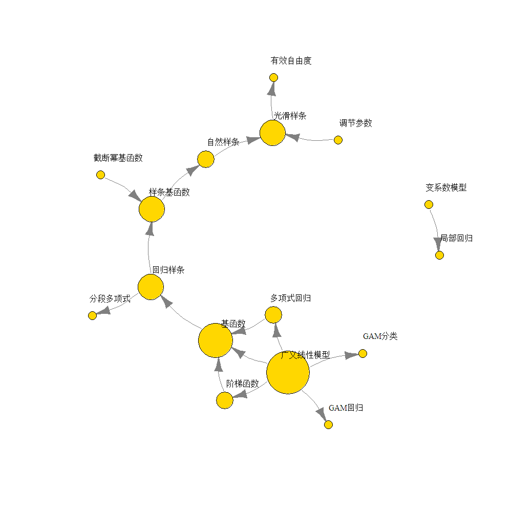
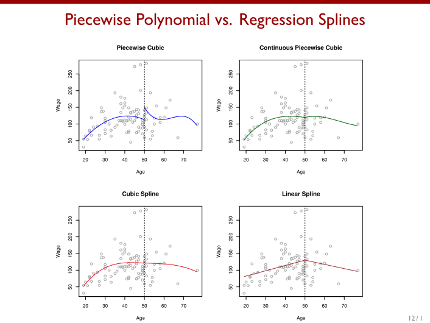
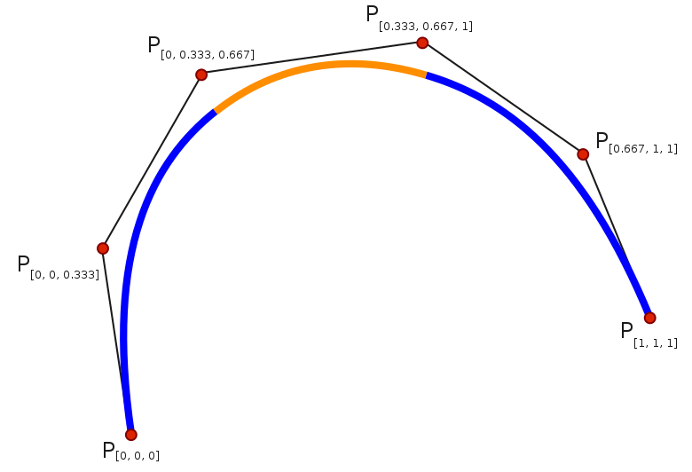
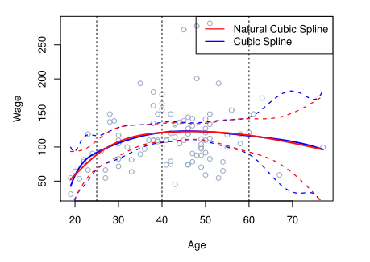

*学习资源来自于Gareth James等的《统计学习导论——基于R应用》，*<br>
*提供的代码可见于http://www-bcf.usc.edu/~gareth/ISL/Chapter%207%20Lab.txt*
    
非线性模型内容：
    
<center>

</center>
    
```{r,echo=FALSE,warning=FALSE,message=FALSE}
#library(igraph)
#SNA<-openxlsx::read.xlsx('chapter7.xlsx')
#SNA<-as.matrix(SNA)
#SNA<-SNA[,-1]
#SNA<-graph_from_adjacency_matrix(SNA)

#deg<-degree(SNA)*5
#l <- layout_nicely(SNA)
#plot(SNA,
#    layout=l,
#    vertex.size=deg,
#    vertex.color="gold",
#    vrtex.label.cex=0.8,
#    vertex.label.dist=2,
#    edge.arrow.size=0.2,
#    edge.curved=0.2,
#    vertex.label.color='black',
#    edge.color = grey(0.5),
#    type="l",
#    vertex.shapes=NULL)
```
    
线性模型的关键原则是变量之间存在线性关系，但这只是一个漂亮的简化假设，在实际中，变量之间的关系往往是非线性的，本章的模型是在线性模型上的简单推广，力图在保持模型良好前提下，放松线性假设。

# 多项式回归

对线性模型的推广思路是以预测变量的幂作为新的预测变量以替代原始变量。
将标准线性模型
$$y_i=\beta_0+\beta_1x_i+\varepsilon_i$$
转化为一个多项式函数
$$y_i=\beta_0+\beta_1x_i+\beta_2x_i^2+...+\beta_dx_i^d+\varepsilon_i$$
这种方法称为**多项式回归**。
因为从本质上来说，还是对于$x_i,x_i^2,x_i^3,...,x_i^d$的线性模型，所以用OLS方法就可以计算多项式函数的系数。

注：阶数d不宜过大（一般不大于3或4），过大的d，会导致过分的光滑，也有可能导致在X变量定义域的边界处出现不合理的拟合结果。
```{r include=FALSE}
library(ISLR)
attach(Wage)
```
```{r include=FALSE}
#多项回归的四种书写方法，结果一致

fit=lm(wage~poly(age,4),data=Wage)
#coef(summary(fit))
fit2=lm(wage~poly(age,4,raw=T),data=Wage)
#coef(summary(fit2))
fit2a=lm(wage~age+I(age^2)+I(age^3)+I(age^4),data=Wage)
#coef(fit2a)
fit2b=lm(wage~cbind(age,age^2,age^3,age^4),data=Wage)
```

下图的数据包含在ISLR程序包的Wage数据集中，左上角散点图包含了居住在美国亚特兰大中部地区男性的收入（wage，单位：千美元）和人口信息（age，年龄）；图中蓝色实线是使用最小二乘法拟合的四阶多项式回归的结果，虚线表示95%置信区间。
    
右下角是针对二元变量wage>250的逻辑斯谛回归模型建模结果，通常采用4阶多项式，蓝色实线表示wage>250的后验概率，虚线则是估计的95%置信区间。左下角和右上角的两幅图片是逻辑斯谛回归的中间过程，将I(wage>250)这一0-1形式的因变量转化以后，用四次多项式拟合其结果，得到右上角图片，转化的形式见于左下角图像，最后将拟合结果转化回概率的形式，得到右下角图像。

```{r message=FALSE,warning=FALSE,echo=FALSE}
agelims=range(age)
age.grid=seq(from=agelims[1],to=agelims[2])
preds=predict(fit,newdata=list(age=age.grid),se=TRUE)
se.bands=cbind(preds$fit+2*preds$se.fit,preds$fit-2*preds$se.fit)#置信区间
par(mfrow=c(2,2),mar=c(4.5,4.5,1,1),oma=c(0,0,4,0))
plot(age,wage,xlim=agelims,cex=.5,col="darkgrey")
title("Degree-4 Polynomial",outer=T)
lines(age.grid,preds$fit,lwd=2,col="blue")
matlines(age.grid,se.bands,lwd=1,col="blue",lty=3)
preds2=predict(fit2,newdata=list(age=age.grid),se=TRUE)
#max(abs(preds$fit-preds2$fit)),两种函数的书写方式，预测结果几乎没有区别
fit.1=lm(wage~age,data=Wage)
fit.2=lm(wage~poly(age,2),data=Wage)
fit.3=lm(wage~poly(age,3),data=Wage)
fit.4=lm(wage~poly(age,4),data=Wage)
fit.5=lm(wage~poly(age,5),data=Wage)
#anova(fit.1,fit.2,fit.3,fit.4,fit.5)，模型比较，5阶以后不存在显著差异
#coef(summary(fit.5))
#(-11.983)^2
fit.1=lm(wage~education+age,data=Wage)
fit.2=lm(wage~education+poly(age,2),data=Wage)
fit.3=lm(wage~education+poly(age,3),data=Wage)
#anova(fit.1,fit.2,fit.3),加入教育变量以后，存在1，2，3的age变量存在区别
###################################图片分界线1########################################
fit=glm(I(wage>250)~poly(age,4),data=Wage,family=binomial)#逻辑斯谛回归
preds=predict(fit,newdata=list(age=age.grid),se=T)
pfit=exp(preds$fit)/(1+exp(preds$fit))
se.bands.logit = cbind(preds$fit+2*preds$se.fit, preds$fit-2*preds$se.fit)
se.bands = exp(se.bands.logit)/(1+exp(se.bands.logit))
plot(age.grid,preds$fit)
plot(preds$fit,pfit)

###################################图片分界线2#######################################
preds=predict(fit,newdata=list(age=age.grid),type="response",se=T)
plot(age,I(wage>250),xlim=agelims,type="n",ylim=c(0,.2))
points(jitter(age), I((wage>250)/5),cex=.5,pch="|",col="darkgrey")
lines(age.grid,pfit,lwd=2, col="blue")
matlines(age.grid,se.bands,lwd=1,col="blue",lty=3)

```
    

右下角：从左图看，工资来源于两个不同的总体，两组的分界线在200-260千美元之间，把wage当做二元变量，以250000为分界线，这样就能以逻辑斯谛回归来预测：
$$Pr(y_i>250|x_i)=\frac{e^{\beta_0+\beta_1x_i+\beta_2x_i^2+\beta_3x_i^3+\beta_4x_i^4}}{1+e^{\beta_0+\beta_1x_i+\beta_2x_i^2+\beta_3x_i^3+\beta_4x_i^4}}$$
逻辑斯谛回归的样本数（n=79）较少，估计系数方差较大，置信区间较宽。
    
# 阶梯函数
如果不希望的到全局的模型，可以使用阶梯函数拟合。
基本思想：将某个预测变量的取值空间切割成K个不同区域，生成一个新的定性变量，分段拟合一个常量函数<br>
$C_0(X)=I(X<c_1)$<br>
$C_1(X)=I(c_1\leq X<c_2)$<br>
$C_2(X)=I(c_2\leq X<c_3)$<br>
$.....$<br>
$C_{K-1}(X)=I(c_{K-1}\leq X<c_K)$<br>
$C_K(X)=I(c_K\leq X)$<br>
I(.)是指示性函数，当条件成立时返回1，否则返回0，由于X只能落在K+1个区间中的某一个，于是对任意X的取值$C_0(X)+C_1(X)+...+C_K(X)=1$，以$C_0(X)、C_1(X),.....,C_K(X)$为预测变量用最小二乘法来拟合线性模型：
$$y_i=\beta_0+\beta_1C_1(x_i)+\beta_2C_2(x_i)+...+\beta_KC_K(x_i)+\varepsilon_i$$
当$X<c_1$时，式中每个预测变量都为0，因此$\beta_0$成为$X<c_1$时的Y的平均值；   
当$c_j<X<c_j+1$时，预测值为$\beta_0+\beta_j$，$\beta_j$即指当X
由$X<c_1$增加到$c_j<X<c_j+1$时，响应变量的平均增量    
    
>同上，调整逻辑斯蒂回归图
    
用和多项式回归同样的方法，使用阶梯函数反映年龄和收入的关系
$$Pr(y_i>250|x_i)=\frac{e^{\beta_0+\beta_1C_1(x_i)+\beta_2C_2(x_i)+...+\beta_KC_K(x_i)}}{1+e^{\beta_0+\beta_1C_1(x_i)+\beta_2C_2(x_i)+...+\beta_KC_K(x_i)}}$$


```{r message=FALSE,warning=FALSE,echo=FALSE}
#table(cut(age,4))
fit=lm(wage~cut(age,4),data=Wage)
#coef(summary(fit))
agelims=range(age)
age.grid=seq(from=agelims[1],to=agelims[2])
preds=predict(fit,newdata=list(age=age.grid),se=TRUE)
se.bands=cbind(preds$fit+2*preds$se.fit,preds$fit-2*preds$se.fit)#置信区间
par(mfrow=c(1,2),mar=c(4.5,4.5,1,1),oma=c(0,0,4,0))
plot(age,wage,xlim=agelims,cex=.5,col="darkgrey")
title("Piecewise Constant",outer=T)
lines(age.grid,preds$fit,lwd=2,col="blue")
matlines(age.grid,se.bands,lwd=1,col="blue",lty=3)

###############################图片分界线2####################################
fit=glm(I(wage>250)~cut(age,4),data=Wage,family=binomial)
preds=predict(fit,newdata=list(age=age.grid),se=T)
pfit=exp(preds$fit)/(1+exp(preds$fit))
se.bands.logit = cbind(preds$fit+2*preds$se.fit, preds$fit-2*preds$se.fit)
se.bands = exp(se.bands.logit)/(1+exp(se.bands.logit))
preds=predict(fit,newdata=list(age=age.grid),type="response",se=T)
plot(age,I(wage>250),xlim=agelims,type="n",ylim=c(0,.2))
points(jitter(age), I((wage>250)/5),cex=.5,pch="|",col="darkgrey")
lines(age.grid,pfit,lwd=2, col="blue")
matlines(age.grid,se.bands,lwd=1,col="blue",lty=3)
```
    
如果预测变量本书不具有明显的分割点，那么分段给出一个常数就不是特别恰当，例如左边这幅图中，四十岁以前收入增长的趋势就没有表现出来。
    
# 基函数
多项式和阶梯函数回归模型实际上是特殊的积函数方法，基本原理是对变量X的函数或变换$b_1(X),b_2(X),...b_k(X)$进行建模
$$y_i=\beta_0+\beta_1b_1(x_i)+\beta_2b_2(x_i)+...+\beta_Kb_K(x_i)+\varepsilon_i$$
从而来代替线性模型，<br>
对于多项式回归来说，基函数就是$b_j(x_i)=x_i^j$，<br>
而对于阶梯函数来说，基函数就是$b_j(x_i)=I(c_j\leq x_i<c_{j+1})$。<br>
    

# 回归样条
回归样条也是一种基函数，可以看做是前面两种方法的推广。
    
**基本方法：**首先将X的取值范围切割成K个区域，在每个区域分别独立拟合一个多项式函数。回归样条的多项式一般有一些限制以保证在区域边界或称为结点的位置，这些多项式得到光滑的链接。只要X被切割成尽可能多的领域，这个方法就能产生非常光滑的拟合效果。

## 分段多项式
可以理解为将x的取值范围分为多段，在每一段分别进行低阶的多项式回归，在不同区域内$\beta_0,\beta_1,\beta_2$等，均互不相同。而这些系数发生变化的临界点称为结点（knot）。
    
例如，下面的公式即表示只有一个结点c的分段三次多项式，每一个分段都可以各自拟合其多项式。
$$
y=\left\{
             \begin{array}{lr}
             \beta_{01}+\beta_{11}x_i+\beta_{21}x_i^2+\beta_{31}x_i^3+\varepsilon_i, & x_i<c &;\\
             \beta_{02}+\beta_{12}x_i+\beta_{22}x_i^2+\beta_{32}x_i^3+\varepsilon_i, & x_i\geq c & .
             \end{array}
\right.
$$
事实上，阶梯函数可以看做阶数为0的分段多项式。
  
## 约束条件与样条

将前面的年龄和收入数据以age=50为结点，用分段三次多项式进行回归分析。
    
<center>

</center>
    
左上角的图片看上去比较光滑，但是在结点上不连续，为了确保拟合曲线的连续性，需要添加约束条件。<br>
右上角约束条件：连续<br>
左下角（三次样条）约束条件：连续，且一阶导数、二阶导数存在（光滑）<br>
右下角（线性样条）约束条件：结点age=50处连续<br>

从上图可知，采用更多的约束条件则可以得到更光滑的分段多项式。
这是因为，每个对分段三次多项式施加的约束都有效的释放了一个自由度，减少了模型的复杂程度。
例如，对于左上图中原本自由度为8的分段三次多项式
$$
f(x)=\left\{
             \begin{array}{lr}
             \beta_{1}+\beta_{3}x+\beta_{5}x^2+\beta_{7}x^3+\varepsilon, & x<\xi &;\\
             \beta_{2}+\beta_{4}x+\beta_{6}x^2+\beta_{8}x^3+\varepsilon, & x\geq \xi & .
             \end{array}
\right.
$$
三次样条的约束条件$f(ξ−)=f(ξ+),f'(ξ−)=f'(ξ+),f''(ξ−)=f''(ξ+)$意味着
$$
\left\{
             \begin{array}{lr}
             β_1+ξβ_3+ξ^2β_5+ξ^3β_7=β_2+ξβ_4+ξ^2β_6+ξ^3β_8 \\
             β_3+2ξβ_5+3ξ^2β_7=β_4+2ξβ_6+3ξ^2β_8 \\
             2β_5+6ξβ_7=2β_6+6ξβ_8 
             \end{array}
\right.
$$
    
>在统计学中，自由度(degree of freedom, df)
指的是计算某一统计量时，取值不受限制的变量个数。通常df=n-k。其中n为样本数量，k为被限制的条件数或变量个数，或计算某一统计量时用到其它独立统计量的个数。此处要求的统计量为系数向量β的拟合值，每增加一个约束，则β减少一自由度。
    
在这种情形下，三个约束，减少了三个需要估计的参数，意即，单结点的三次样条存在5个自由度。在一般情况下，与K个结点一同使用的三次样条会产生4+K个自由度。
（自由度+=1<-结点+=1）
    
### 样条
**样条**：样条意思是指通过一组给定点集来生成平滑曲线的柔性带。此概念源于生产实践，“样条”是绘制曲线的一种绘图工具，是富有弹性的细长条。绘图时用压铁使样条通过指定的形值点（样点），并调整样条使它具有满意的形状，然后沿样条画出曲线。
    
<center>

</center>
    
《统计学习导论》中“阶”和“次”的概念与百度百科定义的不一致，可能存在问题，采用百度百科的定义：
    
**曲线次数**：样条曲线的次数是由基函数决定的。某一段样条曲线，由控制多边形的相邻连续的几段折线段决定，就是几次样条，最常用的就是二次和三次样条。*二次样条*的某一曲线段只与相应的两段折线段，三个控制多边形顶点有关，改变其中一个顶点，将影响三段样条曲线段，样条函数S(x)需要满足以下条件：S(x)在每个区间上是一个二次多项式，每个结点上具有一阶连续导数；*三次样条*，每一曲线段由相应的三段折线段、四个结点决定，具体的控制要求：各个结点处函数值、一阶导数值、二阶导数值连续。
    
**曲线阶数**：样条阶数=样条次数+1
    
    
《统计学习导论》：**d阶样条**：分段d阶多项式；每个结点的d-1阶导数都是连续的。
    
例，线性样条可以通过下方式得到：在每个区域内拟合一条直线，同时要求在各结点处满足连续性。
    
## 样条基函数

本节主要讲的内容是d阶分段多项式的拟合方法
在回归样条中引入基函数的概念，
例如，对于有K个结点的三次样条函数，可以选择合适的$b_1,b_2,...,b_{K+3}$，作为基函数，形成如下表达式：
$$y_i=\beta_0+\beta_1b_1(x_i)+\beta_2b_2(x_i)+...+\beta_{K+3}b_{K+3}(x_i)+\varepsilon_i$$
    
可以选择不同的基函数来得到等价的三次样条。
最直接的方法就是之前用到的三次多项式$x$,$x^2$,$x^3$，但仅仅估计截距项和这三项的系数是不足以拟合出一条光滑的曲线的，在这种方法里，需要对每个节点$\xi$加一个**截断幂基函数**：
$$
h(x,\xi)=(x-\xi)^3_+=\left\{
             \begin{array}{lr}
             (x-\xi)^3 & x>\xi\\
             0 & 否则
             \end{array}
\right.
$$
原来的每一个分段三次多项式，都可以添加上$\beta_4h(x,\xi)$。
由于有这个截断幂基函数的存在，新的函数能够保证在$\xi$点，本身、一阶导数、二阶导数连续，但三阶导数不连续。此时，只需要根据函数
$$Y=\beta_0+\beta_1X+\beta_2X^2+\beta_3X^3+\beta_4h(X,\xi_1)+\beta_5h(X,\xi_2)+...+\beta_{K+3}h(X,\xi_{K})+\varepsilon$$
用最小二乘法进行回归，就可以估计这个三次样条的K+4个系数。
    
**自然样条**：是在边界上附加了线性约束的回归样条，这个约束条件可以使自然样条的估计在边界区域更稳定。
（边界区域是定义域比最小的结点更小，比最大的结点更大的部分）
      
<center>

</center>
      
## 确定结点的个数和位置
    
在前面的讲解中，结点age=50或者结点age=(25,40,60)都是人为给定的，那么在拟合样条的时候能不能够找到一个合适的结点向量，得到最好的拟合结果呢？
实践证明（这个有兴趣的读者可以自行考证），令结点在数据上呈现均匀分布是一种比较有效的结点选择方式。这种方法的一种实现方式是：首先确定需要的自由度，然后依靠软件自动在数据的均匀分位数点上设置相应个数的结点。
    
需要注意的是自然样条的自由度计算方式普通样条的自由度计算方式不一致。
    
普通三次样条的自由度：K+4（K，结点数）
    
三次自然样条的自由度：K+4-2(-1)
    
下图中的样条设置了三个结点，如果是普通的三次样条，它的自由度应该是7，但通过代码可以看到，我们用的是4个自由度的自然样条，这是因为自然样条在定义域的两侧都增加了约束，通过下面这样的式子，参数的自由度相应的减少了两个，在R中，我们不把截距项的自由度计算在内，因此就参数df的值就是4。
    
$$
\left\{
             \begin{array}{lr}
             Y'(\xi_0)=\beta_1+2\beta_2\xi_0+3\beta_3\xi_0^2=C_1\\
             Y'(\xi_{K+1})=\beta_1+2\beta_2\xi_{K+1}+3\beta_3\xi_{K+1}^2+\beta_4h'(\xi_{K+1},\xi_1)+\beta_5h'(\xi_{K+1},\xi_2)+...+\beta_{K+3}h'(\xi_{K+1},\xi_{K})=C_2
             \end{array}
\right.
$$
    
<center>
```
fit=lm(wage~ns(age,df=4),data=Wage)
```
```{r,echo=FALSE}
library(splines)
fit=lm(wage~ns(age,df=4),data=Wage)
pred=predict(fit,newdata=list(age=age.grid),se=T)
plot(age,wage,col="gray")
lines(age.grid,pred$fit,lwd=2)
lines(age.grid,pred$fit+2*pred$se,lty="dashed")
lines(age.grid,pred$fit-2*pred$se,lty="dashed")
abline(v=attr(ns(age,df=4),"knots"),lty=3)
```
</center>
    
样条函数的自由度选定的方法：
    
+ 一种是尝试多个不同的节点个数，然后从中选择拟合的“形状最理想”的曲线，
+ 另一种较为客观的方法是使用交叉验证法。使用交叉验证时，首先移除一部分数据，然后用剩余的数据来拟合，接着用拟合得到的样条函数来对溢出的那一部分进行预测，这样不断重复多次知道所有数据都被移除过一次，最后计算整体的交叉验证RSS。整个步骤对不同的结点数目K不断重复，选择RSS最小的样条函数对应的K。
    
从下图来看，对于自然样条来说，自由度为3时就足够了。
    
<center>
```{r,echo=FALSE,warning=FALSE,message=FALSE}

require(caret)
set.seed(17)
folds<-createFolds(y=1:nrow(Wage),k=10)

mse1<-c()
for (n in 1:10){
  test<-folds[[n]]
  all<-1:3000
  train<-all[-test]
  fit<-lm(wage~ns(age,df=n),data=Wage[train,])
  pre<-predict(fit,newdata =list(Wage$age[train]) ,se=T)
  #不是很确定这个方法，似乎把全体数据当做了测试集
  sse<-sum((Wage$wage-pre$fit)^2)
  mse<-sse/3000
  mse1[n]<-mse
}

degree<-c(1:10)
plot(degree,mse1,type = 'b',main='自然样条在不同自由度下的均方误差')

```
</center>
    
    
## 与多项式回归对比
    
同样是15个自由度的回归，回归样条的结果要明显的优于15次多项式的回归，尤其是对于自然三次样条而言，在边界上会有更好的拟合结果
    
<center>
```{r,echo=FALSE,message=FALSE,warning=FALSE}
fit1<-lm(wage~ns(age,df=15),data = Wage)
preds1=predict(fit1,newdata=list(age=age.grid),se=TRUE)
fit2<-lm(wage~poly(age,15),data=Wage)
preds2=predict(fit2,newdata=list(age=age.grid),se=TRUE)
plot(age,wage,col='darkgrey')
lines(age.grid,preds1$fit,col='blue',lwd=2)
lines(age.grid,preds2$fit,col='red',lwd=2)
legend('topright',c('自然样条','多项式'),lty=1,lwd=2,col=c('blue','red'))
```
</center>
    
# 光滑样条
## 光滑样条简介
    
光滑样条：将每个不同的$x_i$都设置为结点的自然三次样条
    
光滑样条拟合的目的：找到某个函数$g(x)$，使$RSS=\quad\sum_{i=1}^n{(y_i-g(x_i))^2}$尽量小，但同时控制其光滑程度，避免过拟合。
    
方法：最小化“损失函数+惩罚项”，即：
$$\sum_{i=1}^n{(y_i-g(x_i))^2} +\lambda\int {g''(t)^2dt},\lambda\geq0 $$
    
其中，$\quad\sum_{i=1}^n{(y_i-g(x_i))^2}$是损失函数，使函数g能够更好地拟合数据；而函数$\lambda\int {g''(t)^2dt}$则对函数g的波动性进行惩罚。
    
>加入惩罚项后要如何估算未知参数β的拟合值？损失函数对应的是未知参数β的公式，而惩罚项是不定积分，相当于g''(t)^2 的原函数，显然，在这个原函数里，除了β以外，还有未知参数t和常数C（当然常数C并不影响最小值的求解）。在t依旧未知的情况下，对未知参数β的估算要如何进行？最小二乘法是否还有用?
    
$$\frac{\partial(\sum_{i=1}^n{(y_i-g(x_i))^2})}{\partial \beta_k}+\lambda g''(t)^2 \times 2g''(t) \times \frac{\partial g''(t)}{\partial \beta_k}=0$$
    
二阶导数$g''(t)$衡量的是函数g的**粗糙度**，如果函数在t处波动很大，则其绝对值很大。而常数λ则用来调节函数g曲线的粗糙程度，起到控制偏差-方差权衡的作用，λ越大，函数g越光滑。
    
+ $\lambda=0$，惩罚项不起作用，函数g会快速波动，在各个训练集数据点上做插值
+ $\lambda \to \infty$，g是最小二乘法求得的直线
    
$g(x)$具备的性质：
在结点$x_1,x_2,...,x_n$处是分段三次多项式，且一、二阶导数连续。
在边界节点之外的区域的线性的。
即$g(x)$自然三次样条，但是这种方式得到的自然三次样条有别于之的自然三次样条，可以认为是一种收缩版本。
    
## 选择光滑参数λ
    
参数λ控制着光滑样条的粗糙度，同时也控制着**有效自由度**。$λ: 0 \to \infty$对应实际从自由度$df_λ: n \to 2$。
    
为什么要用有效自由度？——名义自由度被λ大量限制了，故采用$df_λ$来衡量光滑样条的光滑性。    
定义有效自由度，令$$\hat g_\lambda=S_\lambda y$$
    
$\hat g$是一个n维向量，其元素是n个观测点$x_1,x_2,...,x_n$的拟合值，
$\hat g_{\lambda}$是特定的λ值对应的$\hat g$。由于g(x)以每个观测点为节点，$\hat g$中包含了响应变量y中的所有信息，所以可以将$\hat g$表示为$n \times n$的矩阵$S_{\lambda}$与响应变量y相乘的形式，借助这个矩阵，可以定义有效自由度，令
$$df_{\lambda}=\quad\sum_{i=1}^n\{S_{\lambda}\}_{ii}$$
    
要选择恰当的λ，可以采用留一交叉验证法（LOOCV），留一验证法有快捷的运算方式，可以只拟合一个模型就能完成交叉验证，详细的操作可以见ISLR书本相应章节，以及Rob J Hyndman的网站[Fast computation of cross-validation in linear models](https://robjhyndman.com/hyndsight/loocv-linear-models/)，其中
$\{S_{\lambda}\}_{ii}$可以作为杠杆值使用，公式如下所示
$$RSS_{cv}(\lambda)=\sum_{i=1}^n{(y_i-\hat g_\lambda^{(-i)}(x_i))^2}=\sum_{i=1}^n{\bigg[\frac{y_i-\hat g_\lambda(x_i)}{1-\{S_{\lambda}\}_{ii}}\bigg]^2}$$
    
R中用stat包smooth.spline函数可以绘制三次光滑样条，其返回一个项目列表，其中x是不重复的观测值，y是相应的拟合值，df是所用的自由度，参数cv可以用来决定是否通过留一交叉验证法选择实际自由度df。
    
    smooth.spline(x, y = NULL, w = NULL, df, spar = NULL, lambda = NULL, cv = FALSE, all.knots = FALSE, nknots = .nknots.smspl,keep.data = TRUE, df.offset = 0, penalty = 1, control.spar = list(), tol = 1e-6 * IQR(x), keep.stuff = FALSE)
    
运用smooth.spline函数的代码和生成的图像如下所示，通过留一交叉验证法了解到最佳的实际自由度是6.8。
    
```{r message=FALSE,warning=FALSE}
fit1<-smooth.spline(x=Wage$age,y=Wage$wage,df=16)
fit2<-smooth.spline(x=Wage$age,y=Wage$wage,cv=TRUE)
df2<-round(fit2$df,1)
```
<center>
```{r message=FALSE,warning=FALSE,echo=FALSE}
plot(age,wage,data=Wage,main = '光滑样条',col='darkgrey',cex=0.5)
lines(fit1,col='red',lwd=2)
lines(fit2,col='blue',lwd=2)
legend('topright',c('16 自由度',paste(df2,'自由度 (LOOCV)')),
       lty=1,lwd=2,col=c('red','blue'))
```
</center>
    
# 局部回归
    
局部回归的原理是对一个目标观测点$x_0$拟合时，只使用这个点附近的训练观测。这种方法得到的结果与样条比较相近，最大的差别在于局部回归中的区域之间可以重叠，这就保证了局部回归整体光滑的拟合效果。
    
算法:
1.选取所有数据s=k/n比例的最靠近$x_0$的数据$x_i$
2.对选出的数据点赋予其权重$K_{i0}=K(x_i.x_0)$。离$x_0$最远的点权重为0，而最近的点权重最高。那些没有被选中的数据点的权重为0
3.用定义好的权重在$x_i$处拟合加权最小二乘回归，也就是对下式最小化
$$\sum^n_{i=1}K_i0(y_i-\beta_0-\beta_1x_i)^2$$
4.根据$\hat f (x_0)=\hat\beta_0+\hat\beta_1x_0$得到$x_0$的拟合结果
    
第1步中的s(span)意为间距，也就是每一次拟合选中的点占所有点的比例，相当于光滑样条的λ，可以直接给定，也可以用交叉验证法来选择。
    
局部回归技术细节不做具体的探讨，其拟合结果用loess()函数就能得到，从下图中可以看到s=0.5的曲线比s=0.2的曲线更加光滑。
<center>
```{r echo=FALSE}
plot(age,wage,xlim=agelims,cex=.5,col="darkgrey")
title("Local Regression")
fit=loess(wage~age,span=.2,data=Wage)
fit2=loess(wage~age,span=.5,data=Wage)
lines(age.grid,predict(fit,data.frame(age=age.grid)),col="red",lwd=2)
lines(age.grid,predict(fit2,data.frame(age=age.grid)),col="blue",lwd=2)
legend("topright",legend=c("Span=0.2","Span=0.5"),col=c("red","blue"),lty=1,lwd=2,cex=.8)
```
</center>
    
局部回归是**变系数模型**的一种，这种使用最近收集的数据建立模型的方法在1维和2维空间中比较有效，但是当维数超过3或4时，观测值之间的距离就会比较远，导致模型拟合的。
    
# 广义可加模型
    
前面提到的模型其实都只是对简单线性回归模型的推广，如果要推广多元线性回归模型，则可以使用广义可加模型（generalized additive model，GAM）。在GAM提供的框架中，可以对每个变量用非线性的函数进行替换。
    
## 用于回归的GAM
    
对于多元回归模型
$$y_i=\beta_0+\beta_1x_{i1}+\beta_2x_{i2}+...+\beta_px_{ip}+\varepsilon_i$$
可以用$f_j(x_{ij})$替代$\beta_j x_{ij}$，模型可以改成如下形式
$$y_i=\beta_0+\sum^p_{j=1}f_j(x_{ij})+\varepsilon_i\\=\beta_0+f_1(X_{i1})+f_2(X_{i2})+...+f_p(X_{ip)}+\varepsilon_i$$
不同的非线性函数在一个模型中用加法的形式连接在一起，这是GAM的一个例子，也是广义可加模型之所以叫做**可加**模型的原因。
    
继续用ISLR包提供的数据，除了age以外，把工作年限year和受教育水平education也作为自变量纳入模型之中，
$$wage=\beta_0+f_1(year)+f_2(age)+f_3(education)+\varepsilon$$
    
在R中拟合这个模型有两个思路，第一个思路是把f1,f2,f3看做基函数，用最小二乘法拟合，这时可以继续使用函数lm()，但是很多函数并不能表示成基函数的形式，或者不能用最小二乘的方法进行拟合，这时GAM的思路就起到了作用，通过gam包中的gam()函数可以拟合广义可加模型。在下面的代码中，有两个点值得关注，一是提供了拟合光滑样条的函数s()（不同于普通样条bs和自然样条ns），另一个是gam对象的操作方式与lm完全一致，比如plot函数和plot.Gam函数在这里起到了完全一样的效果
    
```{r message=FALSE,warning=FALSE}
gam1=lm(wage~ns(year,4)+ns(age,5)+education,data=Wage)
library(gam)
gam.m3=gam(wage~s(year,4)+s(age,5)+education,data=Wage)
par(mfrow=c(1,3))
plot(gam.m3, se=TRUE,col="blue")
plot.Gam(gam1, se=TRUE, col="red")
```
    
从这两幅图中反映的情况类似，都体现了一些符合直观体验的信息，区别仅在于对前两个变量，第一组图选择了自然样条，而第二组则选择了光滑样条，光滑样条的拟合要更复杂一些，且没有使用最小二乘法，在R中使用一种叫做**向后拟合**的方法来拟合带光滑样条的GAM，这种方法通过循环依次对每个变量更新系数，并在保持其他系数不变的情况下拟合模型，这种方法的好处在于，每一次更新函数时，只要将拟合的方法应用到变量的**部分残差**上。
    
ps：部分残差，当拟合$X_3$时，是当前模型已有的残差$r_i=y_i-f_1(x_i)-f_2(x_i)$，向后拟合时，以这时的部分残差$r_i$作为响应变量拟合模型$f_3$
    
当然，函数选择的方式也不局限于样条，比如下图就用局部回归分析了age和wage的关系。
```{r message=FALSE,warning=FALSE}
par(mfrow=c(1,3))
gam.lo=gam(wage~s(year,df=4)+lo(age,span=0.7)+education,data=Wage)
plot.Gam(gam.lo, se=TRUE, col="green")
```
    
## 用于分类的GAM
    
以logistics回归为例
$$log(\frac{p(X)}{1-p(x)})=\beta_0+\beta_1X_1+\beta_2X_2+...+\beta_pX_p$$
可以转化成
$$log\bigg(\frac{p(X)}{1-p(x)}\bigg)=\beta_0+f_1(X_{1})+f_2(X_{2})+...+f_p(X_{p)}$$
    
用在Wage数据集中期望建立如下的模型
    
$$log\bigg(\frac{p(X)}{1-p(x)}\bigg)=\beta_0+\beta_1 \times year+f_2(age)+f_3(education)\\
p(X)=Pr(wage>250|year,age,education)
$$

```{r echo=FALSE}
gam.lr=gam(I(wage>250)~year+s(age,df=5)+education,family=binomial,data=Wage)
par(mfrow=c(1,3))
plot(gam.lr,se=T,col="green")
```

在右边第三幅图中，对于学历水平低于HS（high school，高中）的观测来说，误差很大，用table函数查看列联表，发现这个数据集中不存在低于高中学历的高收入人群，在这种情况下，可以在GAM模型中通过参数subset指定，在education对应的函数中不考虑高中以下学历的情况。
    
```{r echo=FALSE}
table(education,I(wage>250))
gam.lr.s=gam(I(wage>250)~year+s(age,df=5)+education,family=binomial,data=Wage,subset=(education!="1. < HS Grad"))
par(mfrow=c(1,3))
plot(gam.lr.s,se=T,col="green")
```

