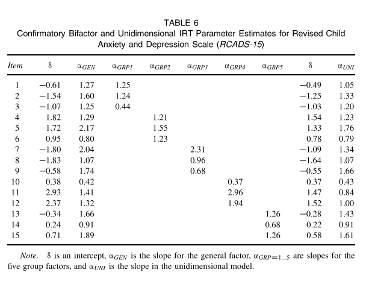

本次分析的数据来自于Steven P. Reise(2012)的论文《[The Rediscovery of Bifactor Measurement Models](http://www.tandfonline.com/doi/citedby/10.1080/00273171.2012.715555#tabModule)》，
    
Reise修订了儿童焦虑和抑郁量表，并收集了其中五个类别题目的数据（n=1060），每一个类别都包括了三项：分离焦虑症（SAD），广泛性焦虑症（GAD），恐慌症（PD），社交焦虑症（SOC），和强迫症（OCD）。问卷如下：
    
```{r table1,echo=FALSE}
options(digits = 2)
temp<-openxlsx::read.xlsx('问卷.xlsx')[1:15,]
knitr::kable(temp,caption = 'Table 1 \n 题目列表')
```
    
根据问卷所收集的数据，原文给出了一个相关矩阵：
```{r include=FALSE}
library(magrittr)
library(psych)
rcads<-read.csv('RCADS-15.csv',header = F)[1:15,-1]
row.names(rcads)[1:15]<-names(rcads)<-c('SAD1','SAD2','SAD3','GAD1','GAD2','GAD3',
                                        'PD1','PD2','PD3','SOC1','SOC2','SOC3',
                                        'OCD1','OCD2','OCD3')

#四分相关矩阵
rcads1<-matrix(data = NA,nrow = 15,ncol=15)%>%as.data.frame()
for(i in 1:15){
  tmp<-which(rcads[i,]==1)
  rcads1[1:tmp,i]<-rcads1[i,1:tmp]<-rcads[i,1:tmp]%>%unlist()
}
row.names(rcads1)<-colnames(rcads1)<-colnames(rcads)

#相关矩阵
rcads2<-matrix(data = NA,nrow = 15,ncol=15)%>%as.data.frame()
for(i in 1:15){
  tmp<-which(rcads[i,]==1)
  rcads2[1:tmp,i]<-rcads2[i,1:tmp]<-rcads[1:tmp,i]%>%unlist()
}
row.names(rcads2)<-colnames(rcads2)<-colnames(rcads)
```
    
```{r table2,echo=FALSE}
knitr::kable(rcads,caption = 'Table 2 \n 四分相关矩阵和Pearson相关矩阵')
```
    
左下角为psych包所做的四分相关矩阵，右上角为Pearson相关矩阵。
    
注：四分相关矩阵（tetrachoric correlation）的公式为：
$$r_t
=\cos \big[\frac{180^{\circ}}{1+\sqrt{\frac{ad}{bc}}}\big] 
=\cos \big[\frac{\sqrt{bc}}{\sqrt{ad}+\sqrt{bc}}\pi\big] $$
    
#探索性bifactor分析——psych包
    
## 相关因子-二阶因子-SL方法
    
```{r include=FALSE}
loading1<-fa(rcads1,nfactors = 5,rotate="oblimin",fm="minres")
attributes(loading1$Phi)$dimnames[[1]]<-
  attributes(loading1$Phi)$dimnames[[2]]<-
  attributes(loading1$Structure)$dimnames[[2]]<-
  attributes(loading1$Vaccounted)$dimnames[[2]]<-
  attributes(loading1$loadings)$dimnames[[2]]<-
  attributes(loading1$weights)$dimnames[[2]]<-c('GAD','OCD','SOC','PD','SAD')
```
    
根据四分相关矩阵进行探索性因子分析，均使用minres(最小残差法)提取与oblimin（斜交转轴法）旋转，所得到的结果大致与Reise一致，但是数值上有略微的差别，有一道SOC的题在GAD中的负荷比SOC中还要大。
    
```{r echo=FALSE}
table3.l<-loading1$loadings[,c(5,1,4,3,2)]
knitr::kable(table3.l,digits = 2)
```
    
计算所得的公共因子的相关矩阵如下：
    
```{r echo=FALSE}
table3.lphi<-loading1$r.scores
colnames(table3.lphi)<-row.names(table3.lphi)<-c('GAD','OCD','SOC','PD','SAD')
knitr::kable(table3.lphi[c(5,1,4,3,2),c(5,1,4,3,2)],digits = 2)
```
    
通过因子分析进行降维，原始的相关矩阵可以表示为五个因子的再生相关矩阵：
$$\hat R = \Lambda_{15,5} \phi_{5,5} \Lambda ^T_{5,15}+ \Theta _{15,15}$$
其中$\hat R$̂是15乘15模型再生矩阵，Λ是15乘5载荷矩阵，φ是主要因子之间相关性的5乘5矩阵，Θ是对角线上具有一阶唯一性的15乘15对角矩阵。结果表明，数据中有一个相当好的独立聚类结构（McDonald，1999）大多数题目仅在五个因子中的一个上有高载荷，其余接近零。 主要因子是中度相关的。 
    
```{r echo=FALSE}
fa.diagram(loading1,cut=.1,digits = 1)
```
    
上图所示，即为相关因子分析所揭示的因子结构。除了题目SOC1
    
在相关因子矩阵$\phi_{5,5}$的基础上，继续进行降维,
$$\phi_{5,5}=\Gamma_{5,1} \Phi_{1,1} \Gamma_{1,5}^T + \Psi_{5,5}$$
其中Γ是二阶主要因子负荷的5乘1矩阵，φ是二阶因子的相关矩阵（在这个简单的情况下是1），ψ是一个5乘5矩阵，代表对角线上的干扰和非对角线上主要因子之间的残差相关性。 
    
```{r echo=FALSE}
loading2<-fa(table3.lphi,nfactors = 1,rotate="oblimin",fm="minres")
fa.diagram(loading2)
```
    
上图反映了一阶因子与二阶因子的关系，通过二阶因子$\Phi_{1,1}$（在这里是数值1）及一阶因子对其的载荷阵$\Gamma_{5,1}$，就可以将一阶相关因子矩阵用再生相关矩阵的形式表现出来。
    
在二阶因子的基础上，可以制作一个5乘6的变换矩阵T，第一列等于二阶因子上一阶因子的载荷，残差矩阵的对角线等于一阶因子无法解释的方差开方。相关因子解的模式矩阵乘以T，就可以来生成bifactor结构，公式如下：
$$SL=\Lambda_{15,5}T=\Lambda_{15,5}[\Gamma_{5,1}|\Psi_{5,5}^{1/2}]=[\Lambda_{15,5} \Gamma_{5,1} | \Lambda_{15,5} \Psi^{1/2}_{5,5}]$$
$$\hat R=(SL)(SL)'+\Theta_{15,15}$$
其仅仅是二阶探索解的重新参数化（正交化）。
    
探索性的bifactor可以通过psych包中的omega函数实现，在本次分析中所得的数据结构如下图所示：
    
```{r echo==FALSE}
loading3<-omega(rcads1,nfactors = 5,fm="minres",sl=TRUE,title = 'bifactor')
```
    
下表的左侧为提取一阶因子以后的因子载荷矩阵，右侧为经过了SL方法以后得到的载荷矩阵。
    
```{r table3,echo=FALSE}
table3.r<-loading3$schmid$sl[,1:6]
colnames(table3.r)<-c('ANX','OCD','GAD','PD','SOC','SAD')
tmp1<-round(table3.l,2)
tmp2<-round(table3.r,2)
tmp1[table3.l<0.2]<-''
tmp2[table3.r<0.15]<-''
knitr::kable(cbind(tmp1,rep('|',ncol(tmp1)),tmp2[,c(1,6,3,4,5,2)]),digits = 2,caption = 'Table 3 \n 一阶因子载荷矩阵 & bifactor载荷矩阵')
```
    
在SL中，所有题目之间的共同方差表示为一般焦虑维度，而较窄焦虑子域表示为五个组因子，它们彼此正交并且与一般焦虑维度正交。因此，SL中的组因子与相关因子模型中的一阶因子不同——后者反映了两个方差来源（一般和组），而前者仅反映了组。这种对方差的分离是bifactor结构表示的主要优点，是许多应用的基础。最后，与二阶相比，SL下的题目直接受到一般因子和组因子的影响，而二阶因子模型中第二阶的因子只能通过间接效应影响具体的题目。

## SL方法的缺陷
    
由前面的分析可以知道：
    
    1. 题目在SL中一般因子上的负载=其在一阶因子上的负载 * 一阶因子在二阶因子上的负载; 
    
    2. 题目在SL中组因子上的负载=其在一阶因子上的负载 * 一阶因子残差的平方根。
    
如果数据不是完美的独立集群结构，并且题目在相关因子模型中交叉负荷两个或多个因子，它也可能会对SL解决方案中的组因子进行交叉负荷，例如RCADS-15数据中的SOC1，这对于SL来说可能是非常有问题的。
如果存在这种情况，一般因子载荷就有可能被高估，同时组因子载荷被低估
（例如，参见 Reise等人，2010;Reise，Moore，＆Maydeu-Olivares，2011）。 多组因子上题目的交叉负荷越大，这种失真的程度越大。
    
如果数据具有完美的独立聚类结构，则同一个组因子内所有题目的一般因子载荷与组因子载荷的比率将完全相同（即成比例）， 这种强制比例负载模式在现实中是不可能存在的。 例如，Brunner等人（2012）注意到，“比例性约束限制了高阶因子模型的价值，一方面提供对一般能力与特定能力之间关系的见解，另一方面提供对其他心理结构，社会人口学特征或生活结果的见解。······”。 
    
## SL方法的替代方案
    
为了解决探索性bifactor模型中施加了比例约束的问题，Reise等(2011)提出了目标bifactor旋转。目标bifactor旋转的基本思想是研究人员基于初步的数据分析或理论，先验地将因子模式矩阵部分数值指定为特定的常数（通常是0），其余待定。之后像往常一样进行旋转、提取因子，但是旋转的目的是要之前所估计矩阵中的部分值尽量接近于之前已指定的常数。
    
为了评估目标bifactor旋转的结果，在蒙特卡罗模拟中，Reise等人（2011）从具有已知的bifactor载荷模式的总体中，生成bifactor项目响应数据。 然后，他们使用初步SL分析的结果来指定目标bifactor模式。 例如，如果SL载荷大于0.20，则将目标模式载荷标记为未指定的元素，如果SL载荷小于0.20，则将目标模式载荷指定为0。 然后，使用Mplus（Muthén＆Muthén，1998-2010），他们评估了目标bifactor旋转能够恢复已知真实总体参数的程度。 特别值得注意的是，目标bifactor旋转的结果，通常能够正确估计题目在组因子上的交叉载荷。
    
```{r include=FALSE}
tmp1<-table3.r
tmp1[tmp1<0.18]<-0
tmp1[tmp1>=0.18]<-NA
tmp1<-list(tmp1[,-1])
tar.bi<-omega(rcads1,nfactors = 5,title = 'target bifactor',rotate = 'TargetQ',Target = tmp1)
```
    
```{r echo=FALSE}
table4l<-tar.bi$schmid$sl[,1:6]
colnames(table4l)<-c('ANX','OCD','GAD','PD','SOC','SAD')
tmp11<-round(table4l,2)
tmp11[table4l<0.15]<-''
```
    
第二种解决方法是分析性的bifactor旋转（Jenn-rich＆Bentler，2011）。这些作者没有进行蒙特卡洛研究来评估这一方案的好坏，而是将bifactor旋转的示例应用提供给先前使用验证性因子方法分析的数据。他们发现这种旋转技术的结果似乎与公布的验证性因子结果一致。
    
```{r include=FALSE}
library(lavaan)
rcads1%<>%as.matrix()
models<-'g =~ +SAD1+SAD2+SAD3+GAD1+GAD2+GAD3+PD1+PD2+PD3+SOC1+SOC2+SOC3+OCD1+OCD2+OCD3 
F1=~  + OCD1 + OCD2 + OCD3 
F2=~  + GAD1 + GAD2 + GAD3 
F3=~  + PD1 + PD2 + PD3 
F4=~  + SOC1 + SOC2 + SOC3 
F5=~  + SAD1 + SAD2 + SAD3'
tmp2<-cfa(models,sample.cov = rcads1,sample.nobs=1060,orthogonal=TRUE,std.lv=TRUE)
ana.bi<-omega(rcads1,nfactors = 5,title = 'analytic bifactor',rotate = 'TargetQ',Target = list(tmp2@Model@GLIST$lambda[,-1]))

table4r<-ana.bi$schmid$sl[,1:6]
colnames(table4r)<-c('ANX','OCD','GAD','PD','SOC','SAD')
tmp22<-round(table4r,2)
tmp22[table4r<0.20]<-''
```
    
下表左侧是目标bifactor旋转的结果，右侧是按照验证性因子分析的结果进行分析性旋转而得到的分析性bifactor载荷矩阵，两者之间以及与之前未经旋转的sl矩阵结果十分相似，但略有不同的是，分析性bifactor旋转以后各组组因子的载荷普遍要比前两种方法更高一些，而一般因子的载荷则要略低，这与Reise的原文不太一致。
    
```{r table4,echo=FALSE}
temp<-cbind(tmp11[,c(1,6,3,4,5,2)],rep('|',nrow(tmp11)),tmp22[,c(1,6,3,4,5,2)])
knitr::kable(temp,caption = 'Table 4: target bifactor & analytic bifactor')
```
    
#验证性因子分析——mirt包
    
在验证性的bifactor模型中，允许每个题目加载一般因子和一个组因子。所有其他载荷固定为零，并且所有因子都指定为正交。 在验证性的bifactor模型中，SL所施加的比例性约束不再重要。 然而，将小的交叉载荷强制为零的扭曲效应的潜在参数，以及容纳具有大量交叉载荷的题目因子仍然很麻烦（参见Finch，2011）。 这是强调在考虑验证性模型之前通过探索性的bifactor分析仔细检查数据结构的原因之一。
    
## 两种参数估计方法
    
序数因子分析模型,将n个二分评分题考虑为一个一般（GEN）和三个（GR）因子：
$$E(x_i^*|\theta_1..\theta_p)=x_i^*=\lambda_{iGEN}\theta_{1GEN}+\lambda_{iGR1}\theta_{GR1}+\lambda_{iGR2}\theta_{GR2}+\lambda_{iGRP3}\theta_{GRP3}+\varepsilon_i$$
其中θ 是潜在因子得分，p =1到P为因子，以及诸λ是标准化因子载荷。 为了完成该模型，需要估计题目的阈值参数(τ)，$x^∗≥τ$时x=1，$x^∗<τ$时x=1。也就是说，只有当他们的反应倾向高于题目的阈值时，个人才会认可该题目。 因此，在序数因子分析中，需要为每个题目估计载荷和阈值参数。
    
实现该模型的一种方法是将Pearson相关性替换为四次或多次相关，然后进行有限信息因子分析（例如，加权最小二乘;参见Wirth＆Edwards，2007）。只有题目之间的均值和协方差用于估计题目参数，因而这些估算器被称为有限信息（Forero，Maydeu-Olivares，＆Gallardo-Pujol，2009）。 例如，Knol和Berger（1991）证明，对于更为复杂的估算方法，四分法的普通最小二乘因子分析通常也可以复原已知的题目参数（参见Finch，2010,2011）。 
    
```{r include=FALSE}
models<-'g =~ +SAD1+SAD2+SAD3+GAD1+GAD2+GAD3+PD1+PD2+PD3+SOC1+SOC2+SOC3+OCD1+OCD2+OCD3 
F1=~  + OCD1 + OCD2 + OCD3 
F2=~  + GAD1 + GAD2 + GAD3 
F3=~  + PD1 + PD2 + PD3 
F4=~  + SOC1 + SOC2 + SOC3 
F5=~  + SAD1 + SAD2 + SAD3'
tmp1<-cfa(models,sample.cov = rcads1,sample.nobs=1060,orthogonal=TRUE,std.lv=TRUE)
temp<-tmp1@Model@GLIST$lambda[,c(1,6,3,4,5,2)]#各题目的负荷
temp<-cbind(temp,tmp1@optim$x[31:45]%>%sqrt)#残差平方根
temp<-cbind(temp,#加上一维模型
            cfa('g =~ +SAD1+SAD2+SAD3+GAD1+GAD2+GAD3+PD1+PD2+PD3+SOC1+SOC2+SOC3+OCD1+OCD2+OCD3',
                sample.cov = rcads1,sample.nobs=1060,orthogonal=TRUE,std.lv=TRUE)@Model@GLIST$lambda)
temp<-rbind(temp,temp^2%>%colSums())#载荷平方和
temp<-rbind(temp,colSums(temp[1:15,])^2)#和的平方
fm.tmp1<-data.frame(fitMeasures(tmp1)%>%as.numeric()%>%t)
names(fm.tmp1)<-names(fitMeasures(tmp1))
```
    
表5的顶部显示了使用稳健最大似然估计来估计验证性bifactor模型的结果（Bentler，2006）。 所有题目都被视为分类，并且通过四重相关矩阵。
有15*14 /  2 = 105个唯一相关和30个估计参数（组因子上有15个负载，一般因子上有15个负载）。
因此，105-30=`r fm.tmp1$df`自由度。
CFI`r fm.tmp1$cfi`，RMSEA为`r fm.tmp1$rmsea`，SRMR为`r fm.tmp1$srmr`，表明样本相关矩阵得到很好的还原。
  >注：作者原文中使用的是robust的估计值，这些指标相较原文要差一点
        
```{r table5,echo=FALSE}
temp[temp!=0]<-round(temp[temp!=0],2)
temp[temp==0]<-''
temp[c(nrow(temp)-1,nrow(temp)),c(ncol(temp)-1,ncol(temp))]<-''

row.names(temp)<-c(as.character(1:15),'(∑λ^2)','(∑λ)^2')
colnames(temp) = c('λ_GEN','λ_GRP1','λ_GRP2','λ_GRP3','λ_GRP4','λ_GRP5','θ','λ_UNI')
knitr::kable(temp,caption = 'Table 5')
```
    
第二种类型的bifactor模型估计策略来自IRT文献。
具体而言，IRT的许多应用基于边际最大似然（MML; Bock＆Aitken，1981）估计方法。 这种方法通常被称为“全信息”项目因子分析，
因为它使用整个项目响应矩阵作为校准的一部分（Gibbons＆Hedeker，1992）。
直到最近才有了高效的降维技术（Cai，2010a，2010b，2010c），
大大扩展了 MML估计对各种验证性bifactor模型的效用（Cai，Yang，et al。，2011）。

以下是以逻辑度量表示的双参数bifactor模型：
$$P(x_i=1|\theta)=E(x_i|\theta)=\frac{exp(z_i)}{1+exp(z_i)} \\ 
此时 \  z_i=\alpha_{iGEN}\theta_{GEN}+\alpha_{iGR1}\theta_{GR1}+
\alpha_{iGR2}\theta_{GR2}+\alpha_{iGR3}\theta_{GR3}+\gamma_i$$
    
由公式可知，认可项目的概率取决于
    
1、个人的潜在特质得分
    
2、待估参数θ
    
3、一般和三个组因子
    
4、项目属性：（a）项目在一般因子层面上的区别（$α_GEN$）;  （b）项目在组因子层面上的区别（$α_{GRP} )$）;  （c）γ，反映项目容易度的多维截距参数（较高的值反映具有较高认可比例的项目）。 
    
表6截取自论文原文，显示了IRTPRO（Cai，du Toit，＆Thissen，2011）使用MML全信息估计输出的双参数逻辑bifactor模型的RCADS-15数据的参数估计。 在IRTPRO中每个项目的适合度使用由Orlando和Thissen（2000,2003）开发的经调整的卡方统计来判断。 在本案例中，15项中的2项被判定为不适合，p <0.05。  IRTPRO还显示了反映局部依赖程度的指数（Chen和Thissen，1997），其中较大的值表明在控制潜在性状后项目对之间的残差相关性较高。 在目前的数据中没有发现大的违规行为，这意味着bifactor模型在计算公共方差方面表现良好。
    
<center></center>
    
分析的最后，提供了三个基于整体列联表的拟合优度统计数据，Pearson（由于稀疏列联表而无法计算）和M_2
（Maydeu-Olivares＆Joe，2005）。 蒙特卡洛研究只在经验上支持后者。 在目前的数据中，在75自由度下，$M_2$ 为123.77，p <0.001。 该$M_2$ 值证明模型在SEM框架下可以接受，但在IRT框架下是不可接受的。 然而，报告的RMSEA为0.02，与SEM结果一致。
    
**IRT和SEM Bifactor模型的等价性**
    
$$\lambda_{ip}=\frac{\alpha_{ip}}{\sqrt{1+\sum_{p=1}^P \alpha^2_{ip}}}\alpha_{ip}=\frac{\lambda_{ip}}{\sqrt{\Psi_i}}=\frac{\lambda_{ip}}{\sqrt{1-\sum_{p=1}^P\lambda^2_{ip}}}$$
    
$$\tau_i=\frac{-\gamma_i}{\sqrt{1+\sum_{p=1}^P\alpha^2_{ip}}}    \qquad  \gamma_i=\frac{-\tau_i}{\sqrt{1-\sum_{p=1}^P\lambda^2_{ip}}}$$
    
因此，在RCADS-15分析中，如果将表6中的IRT参数转换为normal-ogive度量（除以1.7）然后转换为因子分析参数，那么估计非常接近于表5的值（未展示）。 但仍需要注意三点（不加赘述）：
    
1、两种方法各有缺点
    
2、两种方法数值上等价，但解释上不同
   
3、两种方法分别基于不同的思路（线性-非线性，全信息-非全信息），拟合结果评估方式完全不同
    
## 嵌套模型 
    
Bifactor嵌套在相关因子模型中，二阶模型嵌套在相关因子模型中，一维模型嵌套在bifactor中
    
```{r include=FALSE}
models<-'
OCD=~  + OCD1 + OCD2 + OCD3 
GAD=~  + GAD1 + GAD2 + GAD3 
PD=~  + PD1 + PD2 + PD3 
SOC=~  + SOC1 + SOC2 + SOC3 
SAD=~  + SAD1 + SAD2 + SAD3
'
tmp2<-cfa(models,sample.cov = rcads1,sample.nobs=1060,std.lv=TRUE )
fm.tmp2<-data.frame(fitMeasures(tmp2)%>%as.numeric()%>%t)
names(fm.tmp2)<-names(fitMeasures(tmp2))
```
    
通过将bifactor一般因子中的负载固定为零并释放对组因子的正交性约束，可以从bifactor导出相关因子模型。 通过指定方差等于1.0的五个潜在变量（组因子）和在每个潜在变量上自由加载的三个题目来估计该模型。 因子相互关系是自由估计的。 该模型具有25个参数估计（15个加载和10个相关），因此df = `r fm.tmp2$df`。 在这个数据中，结果一般（没有原始数据不能进行MLR等估计）：CFI = `r fm.tmp2$cfi`，RMSEA = `r fm.tmp2$rmsea`，SRMR = `r fm.tmp2$srmr`。 用anova函数进行分析，两者存在显著差异bifactor模型，bifactor模型aic值更小，模型更优（原文使用 Satorra-Bentler (1994) scaled chi-square difference test ）
     
```{r include=FALSE}
models<-'
OCD=~  + OCD1 + OCD2 + OCD3 
GAD=~  + GAD1 + GAD2 + GAD3 
PD=~  + PD1 + PD2 + PD3 
SOC=~  + SOC1 + SOC2 + SOC3 
SAD=~  + SAD1 + SAD2 + SAD3
g=~OCD+GAD+PD+SOC+SAD
'
tmp3<-cfa(models,sample.cov = rcads1,sample.nobs=1060,std.lv=TRUE )
fm.tmp3<-data.frame(fitMeasures(tmp3)%>%as.numeric()%>%t)
names(fm.tmp3)<-names(fitMeasures(tmp3))
```
    
相关因子模型的嵌套替代方案是在一阶因子之间的相关性上设置测量结构以尝试建模，从而解释一阶因子之间的相关性。在这些数据中，有五个一阶因子，因此二阶模型嵌套在相关因子中。为了识别二阶模型，对于五个一阶因子中的每一个，在一阶因子内的一个题目的负载被设置为1.0，并且自由地估计干扰。该模型具有20个参数估计（15个加载和5个干扰），因此df =`r fm.tmp3$df` .再次，卡方为`r fm.tmp3$chisq`（`r fm.tmp3$df`df，p <.01），CFI =`r fm.tmp3$cfi`，RMSEA = `r fm.tmp3$rmsea`，SRMR = `r fm.tmp3$srmr`。显然，bifactor，相关因子和二阶模型都为相关矩阵提供了极好的结果。
    
```{r include=FALSE}
models<-'
g=~  + OCD1 + OCD2 + OCD3 + GAD1 + GAD2 + GAD3 + PD1 + PD2 + PD3 + SOC1 + SOC2 + SOC3 + SAD1 + SAD2 + SAD3
'
tmp4<-cfa(models,sample.cov = rcads1,sample.nobs=1060,std.lv=TRUE )
fm.tmp4<-data.frame(fitMeasures(tmp4)%>%as.numeric()%>%t)
names(fm.tmp4)<-names(fitMeasures(tmp4))
```
    
最后，在一维模型中，允许每个题目加载一个潜在变量。这是IRT和SEM中使用的“默认”测量模型（通常在分配项目之后）。在将因子方差固定为1.0之后，估计有15个负载并且df =`r fm.tmp4$df`。
它嵌套在bifactor中，因为它可以通过将bifactor中的所有组因子加载设置为零（或简单地消除它们）来导出。卡方为`r fm.tmp4$chisq`（`r fm.tmp4$df` df，p <.01），CFI = `r fm.tmp4$cfi`，RMSEA = `r fm.tmp4$rmsea`，和SRMR = `r fm.tmp4$srmr`。与之前考虑的多维模型相比，单向模型似乎不是一个合理的候选模型。然而，在随后的部分中，将使用bifactor建模来重新考虑多维RCADS-15数据的一维表示是多么“不可接受”。
    
## 一般因子的不变性 
    
题目参数不变性的概念扩展到bifactor模型，给定一组具有六个5项组因子的30个项目的项目参数估计，例如，估计了15项具有三个5项组因子的项目，不变性的假设意味着仅一个子集，则会产生相同的一般和组因子加载。这个应用的结果很重要。具体而言，建立题目参数不变性是讨论bifactor模型效度的关键步骤。 如果这一点无法证明，研究人员很难讨论bifactor模型的应用，无论项目内容域的哪个子集（组因子）包括在内，至少都要测量大致相同的一般因子。 因此，在表7中显示了几种可能的三个组因子RCADS-15验证性bifactor模型的一般因子的估计值。 这些结果表明，根据模型中包含哪些组因子，一般因子确实略有变化。 因此，建议使用RCADS-15对测量焦虑感兴趣的研究人员使用所有15项。 
    
```{r include=FALSE}
models<-'g =~ +SAD1+SAD2+SAD3+GAD1+GAD2+GAD3+PD1+PD2+PD3+SOC1+SOC2+SOC3+OCD1+OCD2+OCD3 
F1=~  + OCD1 + OCD2 + OCD3 
F2=~  + GAD1 + GAD2 + GAD3 
F3=~  + PD1 + PD2 + PD3 
F4=~  + SOC1 + SOC2 + SOC3 
F5=~  + SAD1 + SAD2 + SAD3'
tmp1<-cfa(models,sample.cov = rcads1,sample.nobs=1060,orthogonal=TRUE,std.lv=TRUE)
tmp11<-tmp1@Model@GLIST$lambda[,1]#λ_GEN

models<-'g =~ +SAD1+SAD2+SAD3+GAD1+GAD2+GAD3+PD1+PD2+PD3
F2=~  + GAD1 + GAD2 + GAD3 
F3=~  + PD1 + PD2 + PD3 
F5=~  + SAD1 + SAD2 + SAD3'
tmp2<-cfa(models,sample.cov = rcads1,sample.nobs=1060,orthogonal=TRUE,std.lv=TRUE)
tmp21<-tmp2@Model@GLIST$lambda[,1]#各题目的负荷

models<-'g =~ +GAD1+GAD2+GAD3+PD1+PD2+PD3+SOC1+SOC2+SOC3
F2=~  + GAD1 + GAD2 + GAD3 
F3=~  + PD1 + PD2 + PD3 
F4=~  + SOC1 + SOC2 + SOC3 
'
tmp3<-cfa(models,sample.cov = rcads1,sample.nobs=1060,orthogonal=TRUE,std.lv=TRUE)
tmp31<-tmp3@Model@GLIST$lambda[,1]#各题目的负荷

models<-'g =~ +PD1+PD2+PD3+SOC1+SOC2+SOC3+OCD1+OCD2+OCD3 
F1=~  + OCD1 + OCD2 + OCD3 
F3=~  + PD1 + PD2 + PD3 
F4=~  + SOC1 + SOC2 + SOC3 
'
tmp4<-cfa(models,sample.cov = rcads1,sample.nobs=1060,orthogonal=TRUE,std.lv=TRUE)
tmp41<-tmp4@Model@GLIST$lambda[,1]#各题目的负荷

models<-'g =~ +SAD1+SAD2+SAD3+PD1+PD2+PD3+OCD1+OCD2+OCD3 
F1=~  + OCD1 + OCD2 + OCD3 
F3=~  + PD1 + PD2 + PD3 
F5=~  + SAD1 + SAD2 + SAD3'
tmp5<-cfa(models,sample.cov = rcads1,sample.nobs=1060,orthogonal=TRUE,std.lv=TRUE)
tmp51<-tmp5@Model@GLIST$lambda[,1]#各题目的负荷

models<-'g =~ +SAD1+SAD2+SAD3+GAD1+GAD2+GAD3+SOC1+SOC2+SOC3
F2=~  + GAD1 + GAD2 + GAD3 
F4=~  + SOC1 + SOC2 + SOC3 
F5=~  + SAD1 + SAD2 + SAD3'
tmp6<-cfa(models,sample.cov = rcads1,sample.nobs=1060,orthogonal=TRUE,std.lv=TRUE)
tmp61<-tmp6@Model@GLIST$lambda[,1]#各题目的负荷
```

```{r table7,echo=FALSE}
temp<-data.frame(Item=1:15,
                 Domain=c('SAD','SAD','SAD','GAD','GAD','GAD','PD','PD','PD',
                          'SOC','SOC','SOC','OCD','OCD','OCD'),
                 λGEN=rep(0,15),
                 λGEN=rep(0,15),
                 λGEN=rep(0,15),
                 λGEN=rep(0,15),
                 λGEN=rep(0,15),
                 λGEN=rep(0,15))
temp[,3]<-round(tmp11,2)
temp[1:9,4]<-round(tmp21,2)
temp[4:12,5]<-round(tmp31,2)
temp[7:15,6]<-round(tmp41,2)
temp[c(1:3,7:9,13:15),7]<-round(tmp51,2)
temp[c(1:6,10:12),8]<-round(tmp61,2)
temp[temp==0]<-''
knitr::kable(temp,caption = 'Table 7: 一般因子的载荷略有变化')
```

#bifactor模型的应用
    
## 区分项目方差
    
心理结构，及其对应的项目反应数据（由评估这类结构的测量工具而得到)，通常被认为具有“分层”或“多方面”结构（Brunner等人，2012; Chen等人，2012）。
心理特征影响了人的行为，这种影响是经过错杂的行为领域实现的。如果度量包括来自这些错杂领域的多个项目，则项目响应数据将至少具有两个常见的方差源：一个，影响所有项目的因素（反映概念上广泛的一般特征），另一个影响子集内容同质项（反映狭义的子域）。 
    
在这些情况下，因子分析通常会揭示数据不是严格一维的，并且多维模型（如相关因子，二阶或者bifactor）可以更好地说明项目之间的相关性。 然而，由于一般因素和群体因素的正交性，只有后一种模型允许研究人员轻松地将项目响应方差划分为两个共同的来源。 反过来，这种划分在评估和改进现有仪器以及进一步理解特征结构方面可能是非常宝贵的。 
    
```{r include=FALSE}
temp<-tmp1@Model@GLIST$lambda[,c(1,6,3,4,5,2)]#各题目的负荷
temp<-cbind(temp,tmp1@optim$x[31:45]%>%sqrt)#残差平方根
temp<-cbind(temp,#加上一维模型
            cfa('g =~ +SAD1+SAD2+SAD3+GAD1+GAD2+GAD3+PD1+PD2+PD3+SOC1+SOC2+SOC3+OCD1+OCD2+OCD3',
                sample.cov = rcads1,sample.nobs=1060,orthogonal=TRUE,std.lv=TRUE)@Model@GLIST$lambda)
temp<-rbind(temp,temp^2%>%colSums())#载荷平方和
temp<-rbind(temp,colSums(temp[1:15,])^2)#和的平方
fm.tmp1<-data.frame(fitMeasures(tmp1)%>%as.numeric()%>%t)
names(fm.tmp1)<-names(fitMeasures(tmp1))
```
    
由表5可知，＃1，＃4，＃7等项目一般因素和组因子的共同方差大致相等。 另一方面，项目＃3（对人群的恐惧）和＃9（恐慌）主要是一般因素的指标。 项目＃11（担心别人的意见）则正好相反，主要负载社交焦虑组因素。 项目＃10（担心表现不佳）似乎不是一般或社交焦虑组因素的良好指标。 最后，请注意，对组因子具有高负载的项目集可能表示过多的内容相似性。 例如，项目＃11和＃12在"社交焦虑"组因子上具有非常高的`r temp[11,5]`和`r temp[12,5]`负载，可能是多余的。 这是一个重要的考虑因素—— 我们希望组因素反映出狭义的心理特征，而不仅仅是以略微不同的方式反复提出相同问题。 
    
## 确定数据的维度
    
一维的IRT模型相当稳健，但是它的意义和度量方法上尚没有定论。如果多维项目响应数据与bifactor结构一致，则有一种简单的方法来索引单维度。
    
具体地，所解释的公共方差（ECV）可以被定义为由一般因子与一般加上组因子的方差比。 在表5的底部显示了由RCADS-15数据中的公共因子解释的方差（平方负载的总和）。
这些值导致ECV指数为`r temp[16,1]/sum(temp[16,-7])`，反映出这些数据中的一般方差和组因子的公共方差大致相等。 一般而言，ECV越高，相对于组因子的一般因子“更强”，因此研究人员将一维测量模型应用于多维数据的可信度越高。 然而，遗憾的是，由于ECV和参数偏差之间的关系由数据结构决定，所以没有提出ECV的基准值来确定相对一般因子强度何时足够高，以便将一维模型应用于多维（bifactor）数据是安全的。 
    
如果项目响应数据是bifactor，并且这些数据被强制转换为一维模型，结构参数偏差（取决于载荷的偏差）是一般因子与组因子（ECV）的相对强度的函数，而ECV又由未污染相关性（PUC）的百分比来调节。 一般而言，当PUC非常高（> 0.90）时，即使低ECV值也可导致无偏的参数估计。 要了解PUC指数，请参考RCADS-15：存在
`r dim(rcads)[1]` $\times$  `r dim(rcads)[2]-1`= `r dim(rcads)[1]*(dim(rcads)[2]-1)/2`组题目之间的相关关系。 
组因子中项目的相关性受到一般因素和组因子方差的影响，并且$[（3 \times (3-1)）/ 2] \times 5 = 15$。 来自不同组因子题目间的相关性仅反映一般因子方差，也就是说存在$105-15 = 90$未受污染的相关性，
因此，PUC是$90/105 = 0.86$——一个比较大的值。
    
例如，在表5和表6中，当分别拟合一维SEM和IRT（逻辑度量）时，在RCADS-15中显示估计参数。在任一模型中观察到，尽管RCADS-15具有大量的多维度（非常适合六因子模型），一维模型中的参数估计与bifactor中的一般因子上的参数估计相当一致。 这证明了一维模型中的潜变量与bifactor模型中的一般因子相同，因此，对于一维IRT或SEM模型应用，RCADS-15项目响应可能确实是“一维就够了”。 考虑到相对适度的ECV值以及验证性一维模型没有提供足够的数据拟合这一事实，这一结果令人惊讶，如前所述（参见Reise等，出版中，进一步讨论）。
    
例如，具有10个3项组因子的30项测试产生的PUC为0.93。 
相比之下，对于具有3个10项组因子的相同30项测量，PUC将仅为0.69。 在
后一种情况下，只有当ECV非常高时，才能使用一维模型对多维数据建模，而没有高度的参数偏差。 
    
## 解释量表得分
    
要解释量表的得分，首先必须区分数据中的单维度和总分数反映单个题目原始得分的程度，但是ECV在这个问题上没有太大的价值。因此，为了判断复合尺度分数可被解释为单个共同因子的度量的程度，我们需要一个称为系数omega等级的相关指数（McDonald，1999; Zinbarg，Revelle，Yovel，＆Li，2005）。 
    
$$\omega_H=\frac{(\sum \lambda_{iGEN})^2}{(\sum \lambda_{iGEN})^2+(\sum \lambda_{iGRP_1})^2+(\sum \lambda_{iGRP_2})^2+...+(\sum \lambda_{iGRP_P})^2+\sum \theta_{i}^2}$$
其中p代表每个公因子（一般和组）， $θ_i^2$是项目的误差方差。 一般而言，$ω_H$与量表长度，一般因子的平均载荷以及PUC值呈正相关。
    
当项目响应数据与bifactor结构一致时，Omega等级是合适的指标。 该指数只是一般因子的平方因子载荷的平方和除以（模型中）量表分数的方差。 这些值也显示在表5的底部。
请注意，分母项（`r temp[17,1:6]`和`r temp[16,7]`）的总和加起来为`r sum(temp[17,1:6])+temp[16,7]`，
在这种情况下等于观察到的四重相关矩阵中元素的总和`r sum(rcads1)`。
    
使用表5中的报告值，在RCADS-15数据中$ω_H$估计为`r temp[17,1]/(sum(temp[17,1:6])+temp[16,7])`。 这个值可以与下列公式中所示的omega ω（Lucke，2005）对比，下列公式也是基于模型的可靠性估计。 ω指数类似于系数α，并受所有常见方差来源的影响。 
在目前的数据中，ω估计为`r sum(temp[17,1:6])/(sum(temp[17,1:6])+temp[16,7])`。
$$\omega_H=\frac{(\sum \lambda_{iGEN})^2+(\sum \lambda_{iGRP_1})^2+(\sum \lambda_{iGRP_2})^2+...+(\sum \lambda_{iGRP_P})^2}{(\sum \lambda_{iGEN})^2+(\sum \lambda_{iGRP_1})^2+(\sum \lambda_{iGRP_2})^2+...+(\sum \lambda_{iGRP_P})^2+\sum \theta_{i}^2}$$
    
当$ω_H$高时，即使数据是多维的，综合得分也主要反映单个共同来源。
    
## 分量表的效度
    
如果数据适合使用bifactor模型，那么系数Omega等级可以计算分量表的效度。
    
使用术语omega subscale($ω_S$) 来阐明它是残差子量表的效度估计 —— 由于一般因子控制效度的那部分。
例如，对于SAD子量表，一般因子负载的平方和为`r tmp1<-sum(temp[1:3,1])^2;tmp1`，
组因子负载的平方和为`r tmp2<-sum(temp[1:3,2])^2;tmp2`，
误差方差之和为`r tmp3<-sum(temp[1:3,7]);tmp3`。
因此，子量表的系数$\omega$是`r (tmp1+tmp2)/(tmp1+tmp2+tmp3)`。
如果消除一般因子的影响，那么SAD子量表的$\omega_S$是`r tmp2/(tmp1+tmp2+tmp3)`。
    
```{r include=FALSE}
ome<-function(x){
  tmp1<-sum(temp[(3*x-2):(3*x),1])^2
  tmp2<-sum(temp[(3*x-2):(3*x),x+1])^2
  tmp3<-sum(temp[(3*x-2):(3*x),7])
  ome<-(tmp1+tmp2)/(tmp1+tmp2+tmp3)
  omes<-tmp2/(tmp1+tmp2+tmp3)
  y<-cbind(ome,omes)
  return(y)
}
```

    
其余四个分量表的系数$ω$分别`r ome(2)[1]`，`r ome(3)[1]`，`r ome(4)[1]`和`r ome(5)[1]`。
其余四个分量表的系数$ω_S$分别是`r ome(2)[2]`，`r ome(3)[2]`，`r ome(4)[2]`和`r ome(5)[2]`。 这些值清楚地表明，如果要形成总分和分量表，则将分量表作为唯一构造的精确指标的解释是非常有限的—— 由于存在一般因子，存在非常小的可靠方差。


