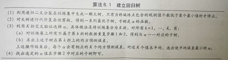

```{r setup, include=FALSE}
knitr::opts_chunk$set(echo = TRUE)
```


决策树在回归中称为回归树，在分类中称为分类树

树的终端结点（terminal node）=树叶（leaf）

树的内部结点（internal node）用来把预测变量空间分开

树的分支（branch）用来把树内部各个结点的连接起来


#经典决策树

##分类树

对某个给定预测的观测值，用它所属区域中**训练集**的众数对其进行预测

###经典算法

**1、ID3**[Quinlan,1986]:用信息增益(information gain)来划分结点

用属性a对样本集D进行划分所获得的信息增益为$Gain(D,a)=Ent(D)-\sum_{m=1}^{M}\frac{\lvert D^m\rvert}{\lvert D\rvert}Ent(D^m)$，其中，$Ent(D)=-\sum_{k=1}^{K}p_{k}\log p_{k}$,响应变量有K类，$p_{k}$表示数据集D中第k类样本所占的比例，m是属性a可取值数目数，$\frac{\lvert D^m\rvert}{\lvert D\rvert}$的存在是因为不同分支结点所包含的样本数不同，所以要给分支结点赋权。

偏好于选择可取值数目较多的属性。这种划分方法会导致结点过纯，每个分支的样本量过小，具有高方差性，泛化能力差。

**缺点**：1、不能自动处理缺失值，而是需要人工赋值；2、只能处理分类属性，对连续属性毫无办法

**2、C4.5**[Quinlan,1993]:用信息增益率(information gain ratio)来划分结点

$Gain.ratio(D,a)=\frac{Gain(D,a)}{IV(a)}$，其中，$IV(a)=-\sum_{m=1}^{M}\frac{\lvert D^m\rvert}{\lvert D\rvert}\log\frac{\lvert D^m\rvert}{\lvert D\rvert}$，当属性a可取值数目越多，也就是M越大，$IV(a)$越大，因此信息增益率偏好于选择可取值数目较少的属性。

但是C4.5不是直接使用信息增益率的，而是先从候选的划分属性中找出信息增益高于平均水平的属性，再从中选择信息增益率最高的

**优点**：1、可以自动处理缺失值。我们每一个属性的取值都有若干个，根据训练集每个可能的取值都有一个概率，我们用这个概率来表示这个缺失值得可能取值2、可以处理连续值

**缺点**：慢【所以有一个改进的版本：商用版本C5.0，速度是C4.5的十倍以上】

**3、CART**(classification and regression tree)[Breiman et al.,1984]：用基尼系数(Gini index)来划分结点。

基尼系数被视为衡量结点纯度（purity）的指标，如果基尼系数较小，就意味着某个结点包含的观测值几乎都来自同一类别。基尼指数的通俗解释就是：表示一件事物的不确定性，基尼指数越大不确定性越大。我们要找基尼指数小的属性，这样的属性对于划分数据集的准确性会更高。

$Gini.index(D,a)=\sum_{m=1}^{M}\frac{\lvert D^m\rvert}{\lvert D\rvert}G$，其中，$G=\sum_{k=1}^{K}p_{k}(1-p_{k})$是基尼值。如果$p_{k}$取值都接近0或者1，基尼值就会很小，相应的，基尼系数就会很小。

选择使基尼系数最小的属性作为最优化分属性。

**优点**：CART既可以做分类树又可以做回归树。

###分类树举例

```{r warning=FALSE,message=FALSE}
Heart <- read.csv("Heart.csv", header = TRUE)
table(Heart$Thal)
table(Heart$ChestPain)
```

对于分类变量，比如说Thal：a,左侧是用Thal的第一个值，也就是最多的那个――>normal，另一侧是除了normal以外的其他值

ChestPain:bc,左侧是ChestPain的第二个第三个值，右侧是除2，3个值以外的（abcd对应于频数从大到小）

**注意**：RestECG这个点，不论取何值，预测结果都是yes。也就是说，这个分裂点产生的两个终端结点具有相同的预测值。

如果在右侧叶节点内（>1），全部9个观测值的响应值均为yes，左侧叶节点内(<1)，11个观测值的响应值里面有7个是yes，那么这两侧终端结点就有了相同的预测值。这个结果存在的意义是为了增加这个结点的纯度。对于某一个测试数据，如果落在右侧，可以相当肯定是yes，如果落在左侧，虽然预测结果还是yes但是实际上的不确定性大大增加。

这种点的存在不是为了降低分类错误，而是为了对基尼系数和互熵这两个对结点纯度更为敏感的指标产生积极影响。


##回归树

###理论概念

对某个给定预测的观测值，用它所属区域中训练集的平均值对其进行预测。CART算法对预测变量空间的分割采用**递归二叉分裂**（recursive binary splitting）,这是一种自上而下的贪婪（greedy）算法，也就是只考虑当前分裂最优，而不从全局考虑。

建立回归树的大致过程：step1：把预测变量空间分割成J个互不重叠的区域$R_1,R_2...R_J$，step2：对落入区域
$R_j$的每个观测值做同样的预测，预测值等于这个空间上训练集的响应值的均值

问题就在于，如何分割预测变量空间。理论上区域空间的形状是任意的，但是出于模型简化和增强可解释性的考虑，将预测变量空间划分成高维矩阵=盒子（box）。

划分区域的目标是使$\sum_{j=1}^{J}\sum_{i\in R_j}(y_i-\hat y_{R_i})^2$最小

贪婪算法就是每做一个分割点，都选择使RSS最小的那个分割点

如果将空间无限分裂下去，那么所有训练集上的点都会被分到一个类，复杂而无用。需要规定某个停止准则，比如一个区域的观测个数小于5，这个区域就不再分裂了。

这种方法，虽然在训练集上RSS会比较小，分的比较好，但是树太多，太复杂可能会出现过拟合。而小一点的树具有更小的方差和更好的解释性，当然会增加些许偏差（方差-偏差权衡），所以我们要考虑剪枝。

###回归树与线性模型比较

如果预测变量和响应变量之间的关系能很好地用线性回归模型来拟合，那么拟合效果将优于不能揭示这种线性结构的回归树；如果两者之间的关系呈现出一种复杂的高度非线性，那么树方法可能更好。


##树的优缺点

**优：**解释性强，更接近人的决策，图形模式使得非专业人士也能看得懂，可以直接处理定性的预测变量而不需要创建哑变量

**缺：**预测准确性一般无法达到其他回归和分类方法的水平，太过复杂的树会存在过拟合问题。

因此要引入**装袋法，随机森林，提升法，剪枝**

##剪枝（先不讲）
代价复杂性剪枝（cost complexity pruning）=最弱联系剪枝（weakest link pruning）

要$\sum_{m=1}^{\lvert T \rvert}\sum_{i:x_i\in R_m}(y_i-\hat y_{R_m})^2+\alpha\lvert T \rvert$最小

其中，$\lvert T \rvert$表示树T的终端结点数，$R_m$是第m个终端结点对应的矩形，$\alpha$是调整系数，在子树的复杂性和与训练数据的契合度之间控制权衡。当$\alpha$增大时，如果树的终端结点数多，他就会为自己的复杂付出代价，那么使上式取到最小值的子树会变的更小。

算法




##三种集群学习方法

###装袋法

减小统计学习方法方差的通用做法：**自助法聚集（bootstrap aggregation）**或称**装袋法（bagging）**，可以改善多种回归模型的预测效果，对决策树尤其有用。

**定量情况**：从训练集中重复抽样，生成B个不同的自助抽样训练集，用第b个自助抽样训练集拟合模型并求得预测值$\hat{f}^{*b}(x)$，最后对所有预测值求平均：$$\hat f_{bag}(x)=\frac{1}{B}\sum_{b=1}^{B}\hat{f}^{*b}(x)$$

B个不同的自助抽样训练集建立起B棵回归树，这些树都是未经剪枝的，方差高而偏差小。对这B棵树的B个拟合值求平均可以减小方差，通过成百上千棵树的组合，袋装法能大幅提升预测准确性。

**定性情况**：B棵树给出B个预测类别，采用多数投票（majority vote）的方法：把B个预测中出现频率最高的类作为总体预测（这个也就是SVM中的多分类中一类对一类的分类方法）

树的个数B不是一个对袋装法起决定作用的参数，B很大时，也不会产生过拟合。在实际中，取足够大的B时，误差能够稳定下来:

假设基分类器的错误率是相互独立的，$\epsilon$是基分类器的错误率，错误预测的概率为$$p(H(x)\not =f(x))=\sum_{k=0}^{\frac{B}{2}}\begin{pmatrix}B\\k\end{pmatrix}(1-\epsilon)^k\epsilon^{B-k}\le\exp(-\frac{1}{2}B(1-2\epsilon)^2)$$


**袋外误差估计**

装袋法每棵树大概可以用三分之二的观测值，剩余三分之一称为树的袋外（out of bag，OOB）观测值。用所有将i个观测值作为OOB的树来预测第i个观测值的响应值，会生成B/3个对第i个观测值的预测，求平均或者执行多数投票，可以得到第i个观测值的OOB预测。以此求得每一个观测值的OOB预测，就可以计算得到总体的OOB均方误差或分类误差，这个是对装袋法模型测试误差的有效估计。

当B足够大的时候，OOB误差实质上与留一法交叉验证误差是等价的，在大数据集上使用装袋法时，使用交叉验证会让计算变得相当麻烦，此时用OOB方法估计测试误差就很方便。

**问题**：与单棵树相比，袋装法可以提高预测的准确性，但是由此得到的模型可能很难解释，他对预测准确性的提升是以牺牲解释性为代价的。

###随机森林

随机森林是一种组成式的有监督学习方法。做随机森林的过程可以看作是对树**去相关（decorrelate）**，这样得到的树，的平均值有更小的方差，因而树的可信度也更高。

对自助抽样训练集，建立决策树。在建立这些决策树时，每考虑树上的一个分裂点，都要从全部的p个预测变量中选出一个包含m个预测变量的随机样本作为候选变量，这个分裂点所用的预测变量只能从这m个变量中选择。在每个分裂点处都重新进行抽样，选出m个预测变量。当m=p时，等同于建立袋装法树。当许多预测变量相关时，取较小的m值建立随机森林通常很有效。通常取$m\approx\sqrt{p}$，也就是说，每个分裂点考虑的预测变量个数约等于预测变量总数的平方根，这就意味着，算法将大部分可用的预测变量排除在考虑范围之外。

在装袋法树的集合中，大多树都会将最强的预测变量用于顶部分裂点，这会造成所有的袋装法树看起来很相似，因为这些装袋法树中的预测变量是高度相关的。

但是，1、对不相关的量求平均2、对许多高度相关的量求平均，这两者带来的方差减小的程度，1比2大得多。随机森林通过强迫每个分裂点仅考虑预测变量的一个子集，克服这个相关的问题。


###提升法

提升法(boosting)与装袋法类似，也能改进许多用于解决回归或分类问题的统计学习方法。

提升法的每棵树的生成要用到之前生成的树的信息。是一种**学习舒缓（learning slowly）**的统计学习方法，与一般的方法相比往往有较好的预测效果。

(算法下次再详细讲)


**三个参数**

1、树的总数B。B值过大可能会出现过拟合（与装袋法和随机森林不同）。用交叉验证来选择B

2、取极小正值的压缩参数$\lambda$。控制着提升法的学习速度。通常取0.001或者0.01，如果$\lambda$很小，则需要很大的B才能获得良好的预测效果。

3、每棵树的分裂点数d。控制着整个提升模型的复杂性。取1建模通常能得到上佳效果，此时每棵树都仅由一个分裂点构成。


##程序

###构建分类树

使用ISLR包中的Carseats数据集进行分类树的创建
```{r warning=FALSE,message=FALSE}
library(ISLR)
High<-ifelse(Carseats$Sales<=8,"No","Yes")
Carseats<-cbind(Carseats,High)
```

**建模**

```{r warning=FALSE,message=FALSE}
library(tree)
fit1<- tree(High ~.-Sales, Carseats)#用除了Sales 之外的所有变量预测High
summary(fit1)#summary列出了生成终端节点的所有变量 以及差错率
```

**结果解读**：用除了Sales之外的所有变量预测High，一共有400条记录，用于生成终端结点的有8个变量："ShelveLoc"，"Price"，"Income"，"CompPrice"，"Population"，"Advertising"，"Age"，"US"   ，终端结点个数$T_0=27$，训练错误率是9%，平均残差$0.4575=170.7/373=-2\sum_{m}\sum_{k}n_{mk}\log\hat{p}_{mk}/(n-\lvert T_0\rvert)$，其中$-2\sum_{m}\sum_{k}n_{mk}\log\hat{p}_{mk}$是分类树的偏差，$n_{mk}$是第m个终端结点处属于第k类的观测值的个数

**画图**

```{r warning=FALSE,message=FALSE}
plot(fit1)
text(fit1,pretty=0,cex=0.4)#pretty=0用于输出所有定性预测变量的类别名，而非首字母
```

```{r warning=FALSE,message=FALSE}
fit1
```
**结果解读**：split（分裂规则）, n（这一分支上的观测数量）, deviance（偏差）, yval（这一分支的整体预测）, (yprob)（这一分支中取Yes和取No的比例），后面带“*”的是终端结点


**分训练集和测试集**

```{r warning=FALSE,message=FALSE}
set.seed(2)#随机种子为了划分训练集和测试集
train<-sample(1:nrow(Carseats),200)
test<-Carseats[-train,]
High.test<-High[-train]

fit2<-tree(High~.-Sales,Carseats,subset = train)
pred<-predict(fit2,test,type="class")
tab<-table(pred,High.test)
tab
sum(diag(prop.table(tab)))
```

**结果解读**:能对测试集上71.5%的数据做出正确预测

**剪枝**

```{r warning=FALSE,message=FALSE}
set.seed(3)
fit3<-cv.tree(fit2,FUN = prune.misclass)
#FUN = prune.misclass意味着用分类错误率来控制交叉验证和剪枝过程
fit3
```
**结果解读**:"size"是所考虑的每棵树的终端结点数，"dev"是对应的交叉验证错误率，当size为9时，交叉验证错误率最低，共有50个交叉验证误差， "k" 是使用的成本复杂性参数

```{r warning=FALSE,message=FALSE}
par(mfrow=c(1,2))
plot(fit3$size,fit3$dev,type="b",main="错误率关于size的变化")
plot(fit3$k,fit3$dev,type="b",main="错误率关于k的变化")
```

**用prune.misclass()剪枝**
```{r warning=FALSE,message=FALSE}
fit4<-prune.misclass(fit2,best=9)#best越大，也即要的分类树的终端结点个数越多，剪枝后的树会更大，分类的准确率会更低
plot(fit4)
text(fit4,pretty=0,cex=0.8)
```

**剪枝后的效果**
```{r warning=FALSE,message=FALSE}
pred2<-predict(fit4,test,type="class")
tab2<-table(pred2,High.test)
tab2
sum(diag(prop.table(tab2)))
```

**结果解读**:剪枝后生成了一棵更加易于解释的树，且提高了分类的准确率


```{r warning=FALSE,message=FALSE}
library(rpart)
set.seed(3)
fit21<-rpart(High~.-Sales,Carseats,subset = train,parms = list(split="information"))
fit21$cptable
```

**结果解读**:cptable是复杂度参数，nsplit是树的分支数，也就是nsplit+1个终端结点数，rel error是训练集中每一种树对应的误差，xerror是基于训练样本所得的10折交叉验证误差，xstd为交叉验证误差的标准差

```{r warning=FALSE,message=FALSE}
plotcp(fit21)
```

**结果解读**:对于所有交叉验证误差在最小交叉验证误差一个标准差范围内的树，最小的树即为最优的树

虚线是基于一个标准差准则得到的上限。这边是=0.7750+0.08175803，按照结果应该使用两次分割即三个终端结点的这个树。

**剪枝**

```{r warning=FALSE,message=FALSE}
fit41<-prune(fit21,cp=0.02083333)
library(rpart.plot)
prp(fit41,type = 2,extra = 104,fallen.leaves = TRUE,main="决策树")
```


**剪枝后的效果**
```{r warning=FALSE,message=FALSE}
pred21<-predict(fit41,test,type="class")
tab21<-table(pred21,High.test)
tab21
sum(diag(prop.table(tab21)))
```

**结果解读**:这个包的函数，是考虑复杂度参数，以剪去最不重要的枝，从而讲树的大小控制在理想范围内，与另一个包的结果有不同（我不知道为什么结果不同），分类结果没有上一个包的函数做出来的分类效果好

###构建回归树

使用MASS包中的Boston数据集进行回归树的创建

```{r warning=FALSE,message=FALSE}
library(MASS)
set.seed(1)
train1<-sample(1:nrow(Boston),nrow(Boston)/2)
fit6<-tree(medv~.,Boston,subset = train1)
summary(fit6)
plot(fit6)
text(fit6,pretty=0)

pred<-predict(fit6,Boston[-train1,])
plot(pred,Boston[-train1,"medv"])
abline(0,1)
mean((pred-Boston[-train1,"medv"])^2)#计算测试均方误差
```
**结果解读**:lstat(社区财富水平)代表社会经济地位底的个体所占比例，这棵树表明lstat值低对应的房价高；回归树的测试均方误差为25.05，所以均方误差平方根是5.005，这意味着这个模型的测试预测值与郊区真实房价的中位数之差在5005美元之内

**剪枝**
```{r warning=FALSE,message=FALSE}
set.seed(3)
fit7<-cv.tree(fit6)#默认用偏差（deviance）来控制交叉验证和剪枝过程
plot(fit7$size,fit7$dev,type="b",main="错误率关于size的变化")
fit8<-prune.tree(fit6,best=5)
plot(fit8)
text(fit8,pretty=0)
```


###装袋法和随机森林

**装袋法**是m=p时的随机森林，是随机森林的一种特殊情况，仍旧使用MASS包中的Boston数据集

```{r warning=FALSE,message=FALSE}
library(randomForest)
set.seed(1)
fit61<-randomForest(medv~.,Boston,subset = train1,mtry=13,importance=TRUE)
#mtry=13即在树的每一个分裂点都要考虑所有预测变量，也就是执行装袋法
pred1<-predict(fit61,Boston[-train1,])
plot(pred1,Boston[-train1,"medv"])
abline(0,1)
mean((pred1-Boston[-train1,"medv"])^2)#计算测试均方误差
```

**结果解读**:测试均方误差为13.5，几乎是单棵回归树树的测试均方误差的一半

**随机森林**

```{r warning=FALSE,message=FALSE}
library(randomForest)
set.seed(1)
fit62<-randomForest(medv~.,Boston,subset = train1,mtry=4,importance=TRUE)
#mtry=4，即树上的每个分裂点都只考虑4个预测变量
pred2<-predict(fit62,Boston[-train1,])
plot(pred2,Boston[-train1,"medv"])
abline(0,1)
mean((pred2-Boston[-train1,"medv"])^2)#计算测试均方误差
```

**结果解读**:测试均方误差为11.6076，意味着在这种情况下，随机森林比装袋法有所提升

**注意**：mtry这个参数建立回归树时默认是p/3，建立分类树时默认取$\sqrt{p}$个变量;randomForest()中还有一个参数是ntree，用来改变生成的树的数目，默认生成500棵树。

###提升法

```{r warning=FALSE,message=FALSE}
library(gbm)
set.seed(1)
fit63<-gbm(medv~.,Boston[train1,],distribution="gaussian",n.trees=5000,interaction.depth=4,shrinkage=0.2,verbose=F)

fit64<-gbm(medv~.,Boston[train1,],distribution="gaussian",n.trees=5000,interaction.depth=4)

par(mfrow=c(1,2))

pred3<-predict(fit63,Boston[-train1,],n.tree=5000)
plot(pred3,Boston[-train1,"medv"])
abline(0,1)


pred4<-predict(fit64,Boston[-train1,],n.tree=5000)
plot(pred4,Boston[-train1,"medv"])
abline(0,1)

mean((pred3-Boston[-train1,"medv"])^2)#计算测试均方误差
mean((pred4-Boston[-train1,"medv"])^2)#计算测试均方误差
```

**注意**：gbm()中，回归问题distribution="gaussian"，分类问题distribution="bernoulli"，n.trees=5000说明提升法一共需要5000棵树，interaction.depth=4每棵树的深度为4，shrinkage=0.2是压缩参数$\lambda$，默认为0.001。上面两个模型的区别在于压缩参数$\lambda$

变量的重要性度量未涉及，随机森林算法可以计算变量的**相对重要程度**

#条件决策树

#缺失值处理

#多变量决策树