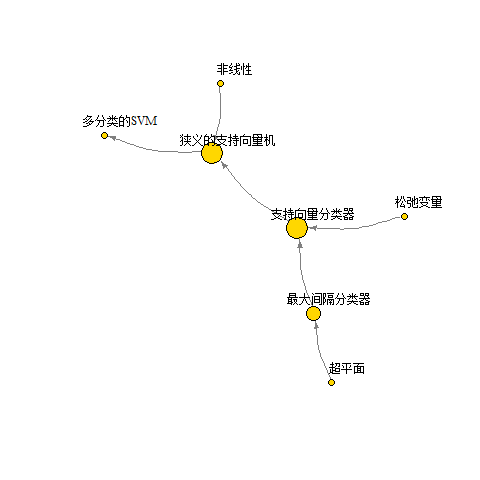

*学习资源来自于Gareth James等的《统计学习导论——基于R应用》，*<br>
*提供的代码可见于http://www-bcf.usc.edu/~gareth/ISL/Chapter%209%20Lab.txt*
    
支持向量机源起于上世纪90年代的计算机界，被认为是适应性最广的分类器之一
```{r,eval=FALSE,include=FALSE}
library(igraph)
SNA<-openxlsx::read.xlsx('chapter9.xlsx')
SNA<-as.matrix(SNA)
SNA<-SNA[,-1]
SNA<-graph_from_adjacency_matrix(SNA)

deg<-degree(SNA)*5
l <- layout_nicely(SNA)
png("struc.png")
plot(SNA,
    layout=l,
    vertex.size=deg,
    vertex.color="gold",
    vrtex.label.cex=0.8,
    vertex.label.dist=2,
    edge.arrow.size=0.5,
    edge.curved=0.2,
    vertex.label.color='black',
    edge.color = grey(0.5),
    type="l",
    vertex.shapes=NULL)
dev.off() 
```
<center>

</center>
    
<center>图`r pic<-1;pic`  知识结构</center>
    
# 最大间隔分类器
## 什么是超平面
p维空间中超平面是p-1维的平面仿射子空间，比如说，
2维空间中的超平面是$\beta_0+\beta_1X_1+\beta_2X_2=0$,是一条直线（1维）；
3维空间中的超平面是$\beta_0+\beta_1X_1+\beta_2X_2+\beta_3X_3=0$,是一个平面（2维）；
p维空间中的超平面就是$\beta_0+\beta_1X_1+\beta_2X_2+...+\beta_pX_p=0$,这是p-1维的。
    
超平面可以把一个空间分割成两个部分，对于观测点X，可以通过上式取值的正负来判断其属于超平面中的哪一侧。
    
## 使用分割超平面分类
    
对于二分类的问题，通常在训练集中把两个分类的相应变量$y_i$分别标记为1和-1，根据前文对超平面的定义，对于$i=1,2,···,n$，衡有
$$y_i (\beta_0+\beta_1X_1+\beta_2X_2+...+\beta_p X_p)>0$$
    
在测试集中，可以根据$f(x^*)=\beta_0+\beta_1x^*_1+\beta_2x^*_2+...+\beta_p x^*_p$的符号来进行分类，若为正，则归在1类，若为负，则在-1类。此外，还可以按照$f(x^*)$的绝对值大小，判断分类的可信程度。
    
```{r echo=FALSE,message=FALSE,warning=FALSE,fig.align="center"}
library(e1071)
options(digits = 3)
set.seed(1)
x=matrix(rnorm(200*2), ncol=2)
y=c(rep(-1,100), rep(1,100))
x[y==1,]=x[y==1,] + 5
plot(x, col=(3-y))
abline(a=6,b=-1)
abline(a=7,b=-1.5)
abline(a=8,b=-2)
```
    
<center>图`r pic<-pic+1;pic` 分割超平面</center>
    
如图`r pic`所示，有多种分割超平面的选择可以有多种方式
    
## 最大间隔分类器
    
超平面可以有有很多种分割方式，需要找到一个分割超平面，使所有这个超平面与训练观测的**间隔**最大，这样的超平面就叫做最大间隔超平面。**间隔**是指所有训练观测点到分割超平面的最小距离。通过判断测试观测落在最大间隔超平面的哪一侧来判断测试观测的类别归属，这就是**最大间隔分类器**。当维度过大时，最大间隔分类器有可能会出现**过拟合**情况。
    
<center>
{ width=50% height=50% }
</center>
    
<center>图`r pic<-pic+1;pic`  最大间隔分类</center>
    
在2维空间中，有三个训练观测到最大间隔超平面的距离是一样的，如果这三个点的位置有所改变，最大间隔超平面也会改变，所以这三个点起到了某种支持作用，被称作**“支持向量”**。这也意味着，在一定范围内，最大间隔超平面只由支持向量决定，与其他向量无关。
    
## 构建最大间隔分类器
    
$n$个观测$x_1,x_2,...,x_n$和其对应的类别标签$y_1,y_2,...,y_n\in\{-1,1\}$，假设超平面是$\beta_0+\beta_1x_{i1}+...+\beta_px_{ip}=0$

那么最大间隔分类器就是一个优化问题$$\max_{\beta_0,\beta_1,...,\beta_p} M$$,

满足
$$
\begin{eqnarray*}
&\sum_{j=1}^{p}\beta_j^2=1& \tag 1\\
&yi(\beta_0+\beta_1x_{i1}+...+\beta_px_{ip})\ge M,i=1,...,n & \tag 2
\end{eqnarray*}
$$

(1)式的约束使得第$i$个观测到超平面的垂直距离为$y_i(\beta_0+\beta_1x_{i1}+...+\beta_px_{ip})$，使得(2)式有意义。(2)式保证了每个观测都在超平面正确的一侧,且与超平面的距离至少为$M$。所以问题就转化为了去找$\beta_0,\beta_1,...,\beta_p$以此最大化$M$，这边通常使用**引入拉格朗日对偶变量+序列最小最优化算法(SMO算法)**来求解（ISLR没有做深入的推导）
        
# 支持向量分类器
    
最大间隔分类器只支持线性可分的情况，如果两个类别之间存在非线性的情况，就有可能无法计算出超平面；
最大间隔分类可能存在着过拟合的问题，单一观测的变化可能造成超平面极大的变化。
    
```{r echo=FALSE,message=FALSE,warning=FALSE,fig.align="center"}
set.seed(1)
x=matrix(rnorm(200*2), ncol=2)
y=c(rep(-1,100), rep(1,100))
x[y==1,]=x[y==1,] + 3
plot(x, col=(3-y))
```
    
<center>图`r pic<-pic+1;pic`  两类别散点图</center>
    
如上图所示，两种类别的点在边界处相互交错，在最大间隔法下，不存在合适的超平面，将两种点分类。
    
支持向量分类器要做的就是放宽最大间隔的条件，允许分类器在对训练观测进行分类时可以存在判断错误，从而构建更加稳定的分类器。
      
```{r echo=FALSE,message=FALSE,warning=FALSE,fig.align="center"}
dat=data.frame(x2=x[,2], x1=x[,1],y=as.factor(y))
svmfit=svm(y~., data=dat, kernel="linear", cost=10,scale=FALSE)
plot(svmfit, dat)
```
     
<center>图`r pic<-pic+1;pic`  支持向量器分类器</center>
      
如图，符号为“x”的观测被放入了间隔内，或者进入了错误的分类，但至少我们获得了一个分类方案。
      
$n$个观测$x_1,x_2,...,x_n$和其对应的类别标签$y_1,y_2,...,y_n\in\{-1,1\}$，假设超平面是$\beta_0+\beta_1x_{i1}+...+\beta_px_{ip}=0$

那么支持向量分类器就是一个优化问题
$$\max_{\beta_0,\beta_1,...,\beta_p,\varepsilon_1,\varepsilon_2,...,\varepsilon_n} M$$,
    
满足
$$
\begin{eqnarray*}
&\sum_{j=1}^{p}\beta_j^2=1 \tag 1\\
&y_i(\beta_0+\beta_1x_{i1}+...+\beta_px_{ip})\ge M(1-\varepsilon_i),i=1,...,n  \tag 2\\
&\varepsilon_i\ge 0,\sum_{i=1}^{n}\varepsilon_i\le C \tag 3
\end{eqnarray*}
$$

$\varepsilon_1,\varepsilon_2,...,\varepsilon_n$是松弛变量，使得分类器允许训练观测中有小部分观测可以落在间隔的错误的一侧($\varepsilon_i>0$)或是超平面错误的一侧($\varepsilon_i>1$)，$C$是非负调节参数，代表了容忍度，$C$越大，则间隔越大，落在间隔错误的一侧的观测就越多。
    
只有间隔上或者穿过间隔的观测会影响到超平面，这些观测就叫做支持向量，$C$越大，支持向量的个数也就越多。
    
```{r echo=FALSE,message=FALSE,warning=FALSE,fig.align="center"}
svmfit=svm(y~., data=dat, kernel="linear", cost=0.1,scale=FALSE)
plot(svmfit, dat)
```
    
<center>图`r pic<-pic+1;pic`  缩小cost以后的支持向量分类器</center>
    
e1071包svm函数的cost可以起到与调节常数$C$相反的效果，cost是对错误判断的惩罚，
由图`r pic`可以看到，缩小了cost以后，间隔扩大,标记为“x”的观测大大增加了。
    
要想获得最优的cost值，可以参考R语言tune函数给出的结果
    
```{r include=FALSE}
tune.out=tune(svm,y~.,data=dat,kernel="linear",ranges=list(cost=c(0.001, 0.01,0.1, 1,5,10,100)))
summary(tune.out)
```
    
参数$C$的取值通常根据交叉验证的结果来确定，涉及到了统计学习中常见的偏差-方差权衡问题，e1071中的tune函数能通过十折交叉验证获得最佳的参数cost，之前数据中最佳的cost值即为`r tune.out$best.parameters`。同时，tune()函数存储了交叉验证获得的最好模型'。
    
```{r include=FALSE}
bestmod=tune.out$best.model
summary(bestmod)
```
    
e1071包的predict()函数可以用来预测在cost参数值给定的情况下，一组测试观测的类别标签。更换随机种子，生成一个测试数据集，使用之前交叉验证产生的最优模型。
      
```{r echo=FALSE}
library(magrittr)
set.seed(3)
xtest=matrix(rnorm(200*2), ncol=2)
ytest=sample(c(-1,1), 200, rep=TRUE)
xtest[ytest==1,]=xtest[ytest==1,] + 3
testdat=data.frame(x2=xtest[,2],x1=xtest[,1], y=as.factor(ytest))
ypred=predict(bestmod,testdat)
```
```{r}
table(predict=ypred,truth=testdat$y)
```
    
此时，`r table(predict=ypred,truth=testdat$y)%>%diag%>%sum`个测试观测被正确分类了。
    
如果此时改变cost的取值，会导致预测能力下降，部分观测被误分：
        
```{r}
svmfit=svm(y~., data=dat, kernel="linear", cost=10,scale=FALSE)
ypred=predict(svmfit,testdat)
table(predict=ypred, truth=testdat$y)
```
    
如上述代码的运行结果所示，两个原本正确分类的类别中，各有一个测试观测被错误地分类了
    
# 狭义的支持向量机
    
## 使用非线性决策边界分类
    
```{r echo=FALSE,fig.align="center"}
set.seed(1)
x=matrix(rnorm(200*2), ncol=2)
x[1:100,]=x[1:100,]+3
x[101:150,]=x[101:150,]-3
y=c(rep(1,150),rep(2,50))
dat=data.frame(x2=x[,2],x1=x[,1],y=as.factor(y))
plot(x, col=y)
```
    
<center>图`r pic<-pic+1;pic`  非线性边界的分类问题</center>
    
支持向量分类器给出的超平面依旧是线性的，为了解决非线性边界的问题，可以借鉴非线性模型的方法，利用自变量的函数形式扩大特征空间，给出非线性的超平面。例如，若考虑二次多项式，则原有的式子转化为：
$$
\max_{\beta_0,\beta_1,...,\beta_p,\varepsilon_1,\varepsilon_2,...,\varepsilon_n} M\\
满足 \qquad y_i(\beta_0+\sum_{j=1}^{p}\beta_{j1}x_{ji}+\sum_{j=1}^{p}\beta_{j2}x_{ji}^2)\ge M(1-\varepsilon_i),i=1,...,n  \\
\varepsilon_i\ge 0,\sum_{i=1}^{n}\varepsilon_i\le C ,\sum_{j=1}^{p}\sum_{k=1}^{2}\beta^2_{jk}=1 \tag 1
$$
    
```{r echo=FALSE,fig.align="center"}
set.seed(1)
train=sample(200,100)
svmfit=svm(y~., data=dat[train,], kernel="polynomial",degree=2,coef0=0.2,cost=1)
plot(svmfit, dat[train,])
```
    
<center>图`r pic<-pic+1;pic`  基于多项式核函数的支持向量机</center>
    
## 支持向量机
    
在支持向量分类器中，用函数的方式扩大特征空间，如果处理不当，会导致特征过于庞大，计算量激增以致无法实现，支持向量机解决这一问题的思路是引入了**核函数**来扩大特征空间。
    
支持向量分类器优化问题的解只涉及观测的**内积**（内积：两个r维向量$a$和$b$的内积定义为$\langle a,b \rangle = \sum ^r _{i=1}a_{i}b_{i}$）。两个观测的内积为
$$\langle x_i,x_{i'} \rangle = \sum ^p _{i=1}x_{ij}x_{i'j} \tag 1$$
    
可以证明：
    
 - 线性支持向量分类器可以描述为：对于一个新观测x，同每个训练观测求内积，再对每个内积赋予权重参数αi：
 
 $$f(x)=\beta_0+\sum_{i=1}^n\alpha_i\langle x,x_i \rangle \tag 2$$
    
  - 估计参数α1，α2，···，αn和β0
  
需要所有训练观测的$\dbinom{n}{2}$个成对组合的内积$\langle x_i,x_{i'} \rangle $。
    
在$(2)$式中，要计算$f(x)$的值，需要新的观测变量$x$和每一个训练观测$x_i$的内积，事实上，除了支持向量以外，其余训练观测对应的$\alpha_i$都可以看作是0，
因此可以用$\mathcal {S}$代表支持向量观测点的指标集合，将$(2)$改写成
$$f(x)=\beta_0+\sum_{i \in \mathcal {S}}\alpha_i\langle x,x_i \rangle \tag 3$$
从而减少了求和项，极大地减少了计算量。
    
在引入了核函数后，可以用更加一般化的形式
$$K(x_i,x_{i'}) \tag 4$$
来代替内积这样的函数$K$，通常被称为核函数。核函数是一类用来衡量观测变量之间相似性的函数，当满足
$$K(x_i,x_{i'})=\sum ^p_{j=1}x_{ij}x_{i'j} \tag 5$$
就等于使用支持向量分类器，式$(5)$被称为线性核函数。除此之外还有**多项式核函数**
$$K(x_i,x_{i'})=(1+\sum ^p_{j=1}x_{ij}x_{i'j})^d \tag 6$$
    
其中，$d$是正整数，当$d>1$时，能够生成比线性核函数更光滑的决策边界，从本质来说，它是在与多项式自由度$d$有关的高维空间中拟合支持向量分类器。支持向量机就是这样的非线性核函数与支持向量分类器的结合，形式为
$$f(x)=\beta_0+\sum_{i \in \mathcal {S}}\alpha_i K(x,x_i) \tag 7$$
    
一种广受欢迎的核函数选择是**径向基核函数**，形式为
$$K(x_i,x_{i'}=exp(-\gamma \sum_{j=1}^p(x_{ij}-x_{i'j})^2) \tag 8$$
    
式$(8)$中的$\gamma$是一个取值为正的常数，如果测试观测$x^*$离训练观测$x_i$很远，那么径向核函数$K(x^*,x_i)$就会很小，那么在分类函数中，就意味着这个训练观测$x_i$对测试观测$x^*$几乎没有影响，也就意味着，距离$x^*$远的训练观测$x_i$对预测$x^*$的类别几乎没有帮助，这事实上是一种局部的方法。
    
```{r echo=FALSE,fig.align="center"}
set.seed(1)
train=sample(200,100)
svmfit=svm(y~., data=dat[train,], kernel="radial",  gamma=1, cost=1)
plot(svmfit, dat[train,])
```
    
<center>图`r pic<-pic+1;pic`  基于径向核函数的支持向量机</center>
    
图`r pic`中取了径向核函数，且$\gamma=1$，由图可知，SVM由明显的非线性决策边界。
    
要取得最优的γ值与cost值，还可以继续使用tune函数。
    
```{r include=FALSE}
set.seed(1)
tune.out=tune(svm, y~., data=dat[train,], kernel="radial", ranges=list(cost=c(0.1,1,10,100,1000),gamma=c(0.5,1,2,3,4)))
summary(tune.out)
```
    
```{r}
tmp<-table(true=dat[-train,"y"], pred=predict(tune.out$best.model,newdata=dat[-train,]))
tmp
```
    
查看这个最优模型的在测试集上的表现，发现`r 100-100*(tmp%>%diag%>%sum)/sum(tmp)`%的结果被这个SVM误分了。
    
## 心脏数据的应用
    
```{r include=FALSE,fig.align="center"}
library(ROCR)
rocplot=function(pred, truth, ...){
   predob = prediction(pred, truth)
   perf = performance(predob, "tpr", "fpr")
   plot(perf,...)}
```
    
```{r echo=FALSE,fig.align="center"}
set.seed(1)
train<-sample(297,207)
library(MASS)
heart<-read.csv('Heart.csv')[,-1]%>%na.omit()
lda.fit<-lda(AHD~.,data=heart,subset=train)
svm.fit<-svm(AHD~., data=heart[train,], kernel="linear",cost=2,gamma=0.0588)

par(mfrow=c(1,2))
fit.lda=predict(lda.fit,heart[train,],decision.values=TRUE)$x
fit.svm=attributes(predict(svm.fit,heart[train,],decision.values=TRUE))$decision.values
rocplot(-fit.svm,heart[train,"AHD"],main="Training Data",col=2)
rocplot(fit.lda,heart[train,"AHD"],col=1,add=T)
legend('bottomright',c('SVC','LDA'),lty = 1,col = c(2,1))

fit.lda=predict(lda.fit,heart[-train,],decision.values=TRUE)$x
fit.svm=attributes(predict(svm.fit,heart[-train,],decision.values=TRUE))$decision.values
rocplot(-fit.svm,heart[-train,"AHD"],main="Test Data",col=2)
rocplot(fit.lda,heart[-train,"AHD"],col=1,add=T)
legend('bottomright',c('SVC','LDA'),lty = 1,col = c(2,1))
```
    
<center>图`r pic<-pic+1;pic`  SVC与LDA的ROC曲线比较</center>
    
图`r pic`反映了支持向量分类器SVC、线性判别分类器LDA分类结果的ROC曲线，分别对动脉硬化性心脏病进行了预测，由图可知，两种分类方法的差异不大。
    
```{r echo=FALSE,fig.align="center"}
par(mfrow=c(1,2))

svm1<-svm(AHD~., data=heart[train,], kernel="radial",gamma=1e-3)
svm2<-svm(AHD~., data=heart[train,], kernel="radial",gamma=1e-2)
svm3<-svm(AHD~., data=heart[train,], kernel="radial",gamma=1e-1)

fit.svm=attributes(predict(svm.fit,heart[train,],decision.values=TRUE))$decision.values
fit1=attributes(predict(svm1,heart[train,],decision.values=TRUE))$decision.values
fit2=attributes(predict(svm2,heart[train,],decision.values=TRUE))$decision.values
fit3=attributes(predict(svm3,heart[train,],decision.values=TRUE))$decision.values

rocplot(-fit.svm,heart[train,"AHD"],main="Training Data",col=1)
rocplot(-fit1,heart[train,"AHD"],main="Training Data",col=2,add=T)
rocplot(-fit2,heart[train,"AHD"],main="Training Data",col=3,add=T)
rocplot(-fit3,heart[train,"AHD"],main="Training Data",col=4,add=T)
legend('bottomright',c('SVC','SVM:γ=10^-3','SVM:γ=10^-2','SVM:γ=10^-1'),lty = 1,col = c(1:4))

fit.svm=attributes(predict(svm.fit,heart[-train,],decision.values=TRUE))$decision.values
fit1=attributes(predict(svm1,heart[-train,],decision.values=TRUE))$decision.values
fit2=attributes(predict(svm2,heart[-train,],decision.values=TRUE))$decision.values
fit3=attributes(predict(svm3,heart[-train,],decision.values=TRUE))$decision.values

rocplot(-fit.svm,heart[-train,"AHD"],main="Test Data",col=1)
rocplot(-fit1,heart[-train,"AHD"],main="Test Data",col=2,add=T)
rocplot(-fit2,heart[-train,"AHD"],main="Test Data",col=3,add=T)
rocplot(-fit3,heart[-train,"AHD"],main="Test Data",col=4,add=T)
legend('bottomright',c('SVC','SVM:γ=10^-3','SVM:γ=10^-2','SVM:γ=10^-1'),lty = 1,col = c(1:4))
```
   
<center>图`r pic<-pic+1;pic`  支持向量机比较</center>
    
图`r pic`反映了支持向量分类器SVC、以及不同径向基核函数支持向量机结果的ROC曲线，分别对动脉硬化性心脏病进行了预测。由图可知，当径向核函数的γ取值为$10^{-1}$时，在训练集中表现最好，但在测试集中基于径向基核函数的SVM之间差异不大，但又都比支持向量分类器SVC的结果略好一些。
    
# 多分类的SVM
    
将SVM从两分类推广到多分类，一般有两种是思路，分别是**一类对一类**和**一类对其余**。
    
##“一类对一类”的分类方法
    
在“一类对一类”的分类方法中，假设需要分类的类别数$K>2$，构建$\binom{K}{2}$个SVM模型，每个SVM模型可以分隔两个类。
    
例如：
    
```{r echo=FALSE,fig.align="center"}
#e1071包中的svm()函数默认采用“一类对一类”的方法进行分类
set.seed(1)
x=matrix(rnorm(250*2), ncol=2)
x[1:100,]=x[1:100,]+3
x[101:150,]=x[101:150,]-3
y=c(rep(1,150),rep(2,50), rep(0,50))
x[y==0,2]=x[y==0,2]+3
dat=data.frame(x2=x[,2],x1=x[,1], y=as.factor(y))
par(mfrow=c(1,1))
plot(x,col=(y+1))
```
   
<center>图`r pic<-pic+1;pic`  三个分类</center>
    
0,1,2三类可以做出三个SVM模型：0|1,0|2,1|2
    
在三个模型中，测试观测$x^*$分到了0,0,1三类中，那么这个测试观测最终被分到类“0”
    
使用所有$\binom{K}{2}$个SVM模型对一个测试观测进行分类，记录这个测试观测被分到每个类别的次数，分到次数最多的这个类，就是这个测试观测的最终预测类别
    
```{r echo=FALSE,fig.align="center"}
svmfit=svm(y~., data=dat, kernel="radial", cost=10, gamma=1)
plot(svmfit, dat)
```
    
<center>图`r pic<-pic+1;pic`  分类结果</center>
    
##“一类对其余”的分类方法
    
在“一类对其余”分类方法中，同样假设类别数为$K>2$，
但不同的是对第m类与非m的类构建两分类的SVM模型，
这样的话一共有K个SVM模型，把$x^*$分到使$f(x^*)=\beta_{0m}+\beta_{1m}x_1^*+\beta_{2m}x_2^*+...+\beta_{pm}x_p^*$最大的那个类"m"。
    
# 与逻辑斯谛回归以及其他统计方法的关系
    
支持向量分类器可以表现为如下形式：
$$\min_{\beta_0,\beta_1,...,\beta_p} \Big\{ \sum_{i=1}^n \max[0,1-y_if(x_i)]+\lambda\sum_{j=1}^p\beta_j^2 \Big\} \tag 1$$
其中λ为非负的调节参数，当λ较大时，$\beta_0,\beta_1,...,\beta_p$较小，能够容忍的穿过间隔的观测较多，和前面所使用的C类似，都可以用来控制偏差-方差权衡。
    
这是统计学习中常见的“损失函数+惩罚项”的形式：
$$\min_{\beta_0,\beta_1,...,\beta_p} \{ L(\mathbf X,\mathbf y,\beta)+\lambda P(\beta) \} \tag 2$$
    
在岭回归中损失函数$L(\mathbf X,\mathbf y,\beta)=\sum_{i=1}^n(y_i-\beta_0-\sum_{j=1}^px_{ij}\beta_j)^2$
惩罚函数$P(\beta)=\sum_{j=1}^p\beta_j^2$；在lasso中，损失函数与岭回归一致，惩罚函数为
$P(\beta)=\sum_{j=1}^p|\beta_j|$。如果这个损失函数写成$(1)$的形式，就有
$$L(\mathbf X,\mathbf y,\beta)= \sum_{i=1}^n \max[0,1-y_i(\beta_0+\beta_1x_{i1}+...+\beta_px_{ip})]$$
这个损失函数被称为**铰链损失**，和逻辑回归使用的损失函数十分接近。
    
不同的类别可以很好地被分离时，SVM表现更好；不同类别存在较多重叠时，Logistic回归表现更好。

